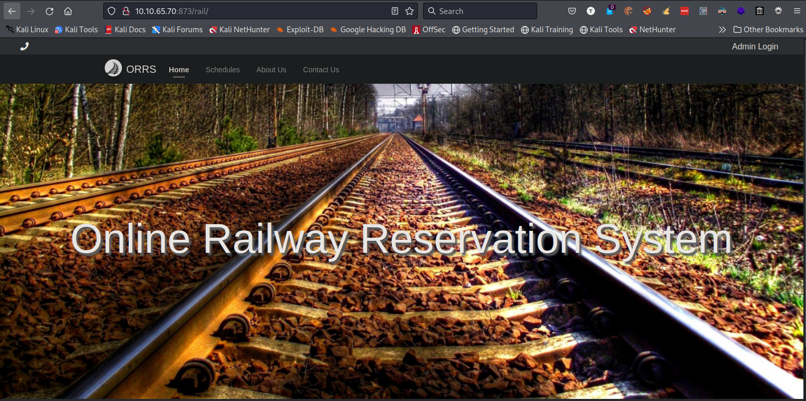
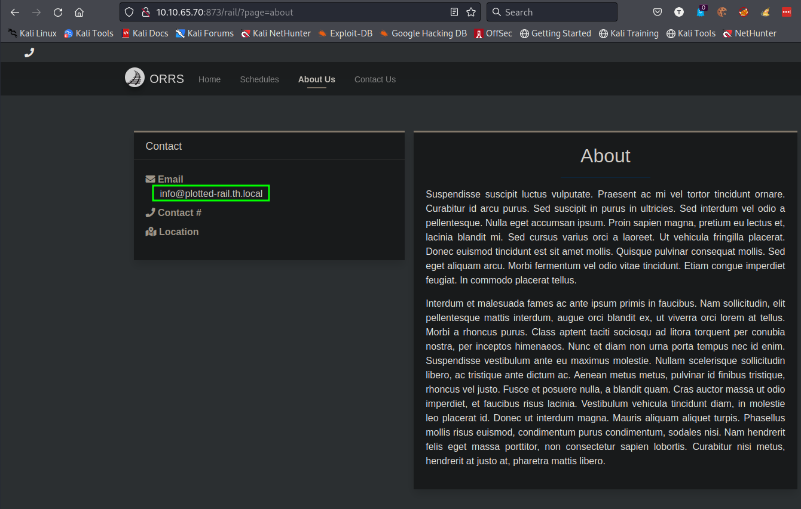
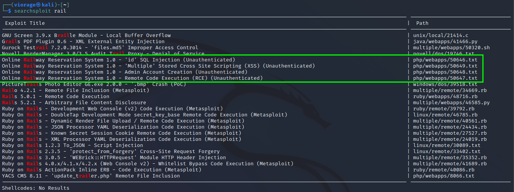
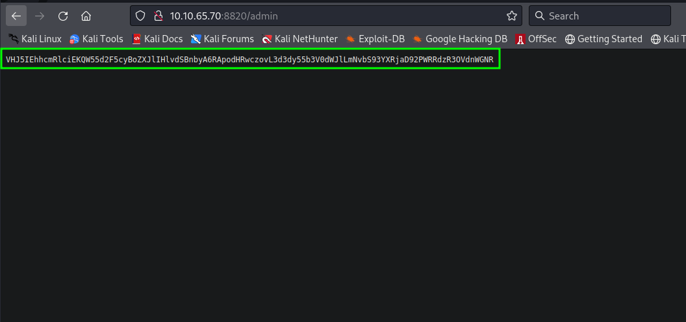
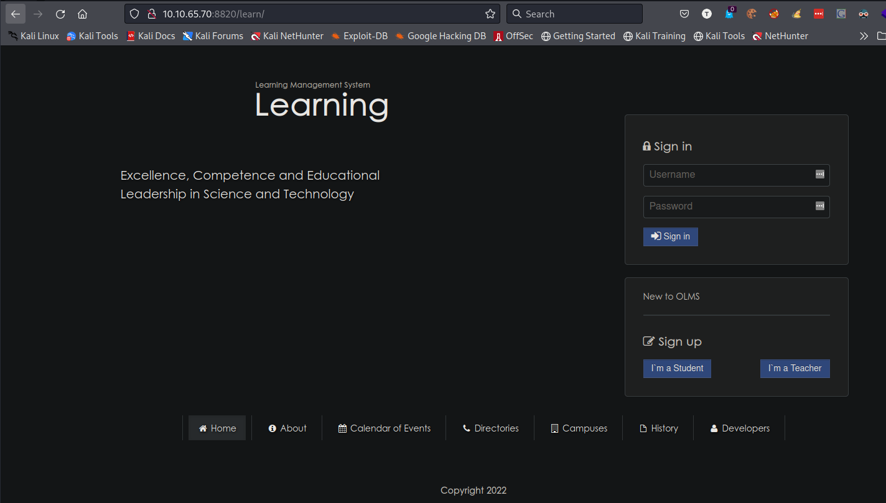
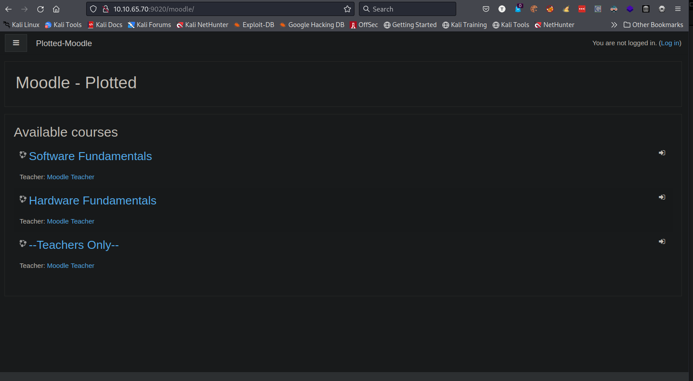
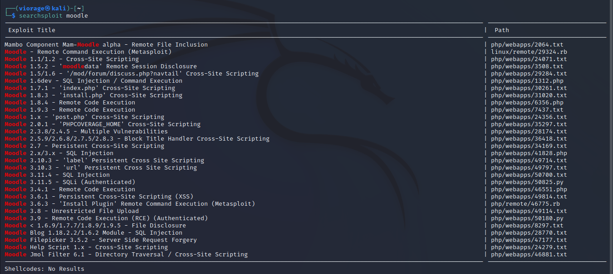
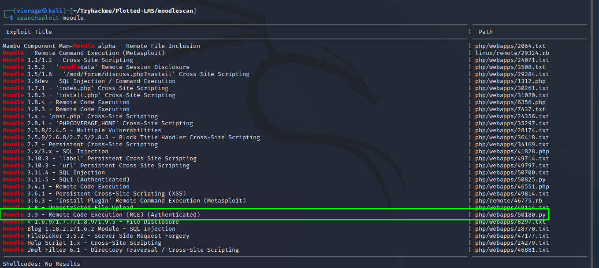

# Plotted-LMS Tryhackme Walkthrough
#### Everything here is plotted!
https://tryhackme.com/room/plottedlms


> Please disregard the IP changes, I do this in the background a lot of times and not all in one sitting.
___

## Nmap: Enumeration

As always we will begin enumerating our target machine with nmap to discover what ports are open. 

> When I was a beginner it helped me to imagine open ports as locked doors to a castle, and is the case with most locks, some can be picked and we have a way in.

I begin with the following scan on all 65535 TCP ports ```sudo nmap -p- --min-rate=8000 <ip>```

```console
┌──(viorage㉿kali)-[~/Tryhackme/Plotted-LMS]
└─$ sudo nmap -p- --min-rate=8000 10.10.221.100
[sudo] password for viorage: 
Starting Nmap 7.92 ( https://nmap.org ) at 2022-04-26 11:25 EDT
Nmap scan report for 10.10.221.100
Host is up (0.24s latency).
Not shown: 65530 closed tcp ports (reset)
PORT     STATE SERVICE
22/tcp   open  ssh
80/tcp   open  http
873/tcp  open  rsync
8820/tcp open  unknown
9020/tcp open  tambora
```

Once all the open TCP ports are identified I'll run a default script ```-sC``` and service/version ```-sV``` scan (-sVC). I'll also spoof my user agent just to show something different.


```console
sudo nmap -sVC -p 22,80,873,8820,9020 --script http-headers --script-args http.useragent="[Mozilla/5.0 (X11; Linux x86_64; rv:91.0) Gecko/20100101 Firefox/91.0]" -oN script 10.10.221.100
```

```console
# Nmap 7.92 scan initiated Tue Apr 26 11:42:16 2022 as: nmap -sVC -p 22,80,873,8820,9020 --script http-headers --script-args "http.useragent=[Mozilla/5.0 (X11; Linux x86_64; rv:91.0) Gecko/20100101 Firefox/91.0]" -oN script 10.10.221.100
Nmap scan report for 10.10.221.100
Host is up (0.22s latency).

PORT     STATE SERVICE VERSION
22/tcp   open  ssh     OpenSSH 8.2p1 Ubuntu 4ubuntu0.4 (Ubuntu Linux; protocol 2.0)
80/tcp   open  http    Apache httpd 2.4.41 ((Ubuntu))
| http-headers: 
|   Date: Tue, 26 Apr 2022 15:42:30 GMT
|   Server: Apache/2.4.41 (Ubuntu)
|   Last-Modified: Mon, 31 Jan 2022 00:21:29 GMT
|   ETag: "2aa6-5d6d5c41143e4"
|   Accept-Ranges: bytes
|   Content-Length: 10918
|   Vary: Accept-Encoding
|   Connection: close
|   Content-Type: text/html
|   
|_  (Request type: HEAD)
|_http-server-header: Apache/2.4.41 (Ubuntu)
873/tcp  open  http    Apache httpd 2.4.52 ((Debian))
| http-headers: 
|   Date: Tue, 26 Apr 2022 15:42:30 GMT
|   Server: Apache/2.4.52 (Debian)
|   Last-Modified: Wed, 02 Feb 2022 12:03:21 GMT
|   ETag: "29cd-5d707cdcc1440"
|   Accept-Ranges: bytes
|   Content-Length: 10701
|   Vary: Accept-Encoding
|   Connection: close
|   Content-Type: text/html
|   
|_  (Request type: HEAD)
|_http-server-header: Apache/2.4.52 (Debian)
8820/tcp open  http    Apache httpd 2.4.41 ((Ubuntu))
| http-headers: 
|   Date: Tue, 26 Apr 2022 15:42:30 GMT
|   Server: Apache/2.4.41 (Ubuntu)
|   Last-Modified: Mon, 31 Jan 2022 02:29:48 GMT
|   ETag: "2aa6-5d6d78ef5e021"
|   Accept-Ranges: bytes
|   Content-Length: 10918
|   Vary: Accept-Encoding
|   Connection: close
|   Content-Type: text/html
|   
|_  (Request type: HEAD)
|_http-server-header: Apache/2.4.41 (Ubuntu)
9020/tcp open  http    Apache httpd 2.4.41 ((Ubuntu))
| http-headers: 
|   Date: Tue, 26 Apr 2022 15:42:30 GMT
|   Server: Apache/2.4.41 (Ubuntu)
|   Last-Modified: Mon, 31 Jan 2022 02:43:11 GMT
|   ETag: "2aa6-5d6d7bed2719e"
|   Accept-Ranges: bytes
|   Content-Length: 10918
|   Vary: Accept-Encoding
|   Connection: close
|   Content-Type: text/html
|   
|_  (Request type: HEAD)
|_http-server-header: Apache/2.4.41 (Ubuntu)
Service Info: OS: Linux; CPE: cpe:/o:linux:linux_kernel

Service detection performed. Please report any incorrect results at https://nmap.org/submit/ .
# Nmap done at Tue Apr 26 11:42:31 2022 -- 1 IP address (1 host up) scanned in 14.90 seconds
```

___

## Website Enumeration
We have 4 web servers and they all show the default apache page so let's begin looking for hidden directories with ```gobuster```

___

## Port 80
I'll start with port 80 and spoof my user-agent again to show a little more evasion techniques and I found nothing.

```console
gobuster dir -u http://10.10.65.70 -w /usr/share/wordlists/dirbuster/directory-list-2.3-medium.txt -x php -a "[Mozilla/5.0 (X11; Linux x86_64; rv:91.0) Gecko/20100101 Firefox/91.0]"```
```

```console
┌──(viorage㉿kali)-[~/Tryhackme/Plotted-LMS]
└─$ gobuster dir -u http://10.10.65.70 -w /usr/share/wordlists/dirbuster/directory-list-2.3-medium.txt -x php -a "[Mozilla/5.0 (X11; Linux x86_64; rv:91.0) Gecko/20100101 Firefox/91.0]" -t 50
===============================================================
Gobuster v3.1.0
by OJ Reeves (@TheColonial) & Christian Mehlmauer (@firefart)
===============================================================
[+] Url:                     http://10.10.65.70
[+] Method:                  GET
[+] Threads:                 50
[+] Wordlist:                /usr/share/wordlists/dirbuster/directory-list-2.3-medium.txt
[+] Negative Status codes:   404
[+] User Agent:              [Mozilla/5.0 (X11; Linux x86_64; rv:91.0) Gecko/20100101 Firefox/91.0]
[+] Extensions:              php
[+] Timeout:                 10s
===============================================================
2022/04/26 15:24:12 Starting gobuster in directory enumeration mode
===============================================================
/server-status        (Status: 403) [Size: 104]
                                               
===============================================================
2022/04/26 15:56:59 Finished
===============================================================
```

___

## Port 873  (Rabbit Hole)
Gobuster again finds: ```http://10.10.65.70:873/rail/```

```console
┌──(viorage㉿kali)-[~/Tryhackme/Plotted-LMS]
└─$ gobuster dir -u http://10.10.65.70:873 -w /usr/share/wordlists/dirbuster/directory-list-2.3-medium.txt  -a "[Mozilla/5.0 (X11; Linux x86_64; rv:91.0) Gecko/20100101 Firefox/91.0]" -t 70
===============================================================
Gobuster v3.1.0
by OJ Reeves (@TheColonial) & Christian Mehlmauer (@firefart)
===============================================================
[+] Url:                     http://10.10.65.70:873
[+] Method:                  GET
[+] Threads:                 70
[+] Wordlist:                /usr/share/wordlists/dirbuster/directory-list-2.3-medium.txt
[+] Negative Status codes:   404
[+] User Agent:              [Mozilla/5.0 (X11; Linux x86_64; rv:91.0) Gecko/20100101 Firefox/91.0]
[+] Timeout:                 10s
===============================================================
2022/04/26 15:58:12 Starting gobuster in directory enumeration mode
===============================================================
/rail                 (Status: 301) [Size: 314] [--> http://10.10.65.70:873/rail/]
/server-status        (Status: 403) [Size: 32]                                    
                                                                                  
===============================================================
2022/04/26 16:09:59 Finished
===============================================================
```


Landing Page:



The `about` page gives us a domain of `plotted-rail.th.local`.



The login page gives me the following title `Online Railway Reservation System`
I saved the logo image and did a reverse photo lookup and it seemed to be a stock photo. I also used searchsploit to look for possible exploit and got a hit for version 1.0.

Searchsploit - 



After a lot of fiddling this ended up being a decent rabbit hole and I moved on.

___

## Port 8820
Gobuster again finds:
- http://10.10.65.70:8820/admin
- http://10.10.65.70:8820/learn

```console
┌──(viorage㉿kali)-[~/Tryhackme/Plotted-LMS]
└─$ gobuster dir -u http://10.10.65.70:8820 -w /usr/share/wordlists/dirbuster/directory-list-2.3-medium.txt  -a "[Mozilla/5.0 (X11; Linux x86_64; rv:91.0) Gecko/20100101 Firefox/91.0]" -t 70
===============================================================
Gobuster v3.1.0
by OJ Reeves (@TheColonial) & Christian Mehlmauer (@firefart)
===============================================================
[+] Url:                     http://10.10.65.70:8820
[+] Method:                  GET
[+] Threads:                 70
[+] Wordlist:                /usr/share/wordlists/dirbuster/directory-list-2.3-medium.txt
[+] Negative Status codes:   404
[+] User Agent:              [Mozilla/5.0 (X11; Linux x86_64; rv:91.0) Gecko/20100101 Firefox/91.0]
[+] Timeout:                 10s
===============================================================
2022/04/26 16:11:14 Starting gobuster in directory enumeration mode
===============================================================
/admin                (Status: 200) [Size: 105]
/learn                (Status: 301) [Size: 317] [--> http://10.10.65.70:8820/learn/]
```

### Admin Page
The admin landing page give us a base64 encoded message of `VHJ5IEhhcmRlciEKQW55d2F5cyBoZXJlIHlvdSBnbyA6RApodHRwczovL3d3dy55b3V0dWJlLmNvbS93YXRjaD92PWRRdzR3OVdnWGNR`



We are given a `Try Harder!` message with a youtube link. If we head to the link we get rick-rolled.

```console
┌──(viorage㉿kali)-[~]
└─$ echo -n 'VHJ5IEhhcmRlciEKQW55d2F5cyBoZXJlIHlvdSBnbyA6RApodHRwczovL3d3dy55b3V0dWJlLmNvbS93YXRjaD92PWRRdzR3OVdnWGNR' | base64 -d                              130 ⨯
Try Harder!
Anyways here you go :D
https://www.youtube.com/watch?v=dQw4w9WgXcQ  
```

So, yes, I got rick rolled nice work


### Learn Page
The `learn` page lands us on an LMS (Learning Management System)



I used searchsploit and again found some exploits that looked familiar. Knowing I was trolled on the first port and rick rolled I actually moved onto the next port. My theory was people normally enumerate in order, at least I do anyways.

___

## Port 9020
Gobuster finds:
- http://10.10.65.70:9020/admin -->Rick Rolled
- http://10.10.65.70:9020/moodle
- http://10.10.65.70:9020/credentials --> Rick Rolled

```console
┌──(viorage㉿kali)-[~]
└─$ gobuster dir -u http://10.10.65.70:9020 -w /usr/share/wordlists/dirbuster/directory-list-2.3-medium.txt  -a "[Mozilla/5.0 (X11; Linux x86_64; rv:91.0) Gecko/20100101 Firefox/91.0]" -t 70
===============================================================
Gobuster v3.1.0
by OJ Reeves (@TheColonial) & Christian Mehlmauer (@firefart)
===============================================================
[+] Url:                     http://10.10.65.70:9020
[+] Method:                  GET
[+] Threads:                 70
[+] Wordlist:                /usr/share/wordlists/dirbuster/directory-list-2.3-medium.txt
[+] Negative Status codes:   404
[+] User Agent:              [Mozilla/5.0 (X11; Linux x86_64; rv:91.0) Gecko/20100101 Firefox/91.0]
[+] Timeout:                 10s
===============================================================
2022/04/26 16:27:34 Starting gobuster in directory enumeration mode
===============================================================
/admin                (Status: 200) [Size: 105]
/moodle               (Status: 301) [Size: 318] [--> http://10.10.65.70:9020/moodle/]
/server-status        (Status: 403) [Size: 104]                                      
/credentials          (Status: 200) [Size: 105]                                      
                                                                                     
===============================================================
2022/04/26 16:39:21 Finished
===============================================================
```

### Admin Page

This turns out to be the same as above


### Moodle Page

The moodle page looks somewhat related to another LMS



___

## Moodle
What is moodle? https://moodle.org/

> Moodle is the world's most popular learning management system. Start creating your online learning site in minutes!

So now we know it's the world's most popular learning management system and it has been riddled with vulnerabilities (see below).

___

## Enumerating Moodle
Let's dig into Moodle a bit deeper. I will run another gobuster scan against `moodle` and see if anything interesting stands out. In the meantime we can enumerate Moodle with searchsploit, google, and whatever else we can find.

Gobuster ended up giving us a ton of new directories.

```console
---SNIP---
[+] Url:                     http://10.10.65.70:9020/moodle
[+] Method:                  GET
[+] Threads:                 70
[+] Wordlist:                /usr/share/wordlists/dirbuster/directory-list-2.3-medium.txt
[+] Negative Status codes:   404
[+] User Agent:              [Mozilla/5.0 (X11; Linux x86_64; rv:91.0) Gecko/20100101 Firefox/91.0]
[+] Timeout:                 10s
===============================================================
2022/04/26 17:16:53 Starting gobuster in directory enumeration mode
===============================================================
/login                (Status: 301) [Size: 324] [--> http://10.10.65.70:9020/moodle/login/]
/privacy              (Status: 301) [Size: 326] [--> http://10.10.65.70:9020/moodle/privacy/]
/files                (Status: 301) [Size: 324] [--> http://10.10.65.70:9020/moodle/files/]  
/user                 (Status: 301) [Size: 323] [--> http://10.10.65.70:9020/moodle/user/]   
/calendar             (Status: 301) [Size: 327] [--> http://10.10.65.70:9020/moodle/calendar/]
/admin                (Status: 301) [Size: 324] [--> http://10.10.65.70:9020/moodle/admin/]   
/comment              (Status: 301) [Size: 326] [--> http://10.10.65.70:9020/moodle/comment/] 
/report               (Status: 301) [Size: 325] [--> http://10.10.65.70:9020/moodle/report/]  
/local                (Status: 301) [Size: 324] [--> http://10.10.65.70:9020/moodle/local/]   
/pix                  (Status: 301) [Size: 322] [--> http://10.10.65.70:9020/moodle/pix/]     
/tag                  (Status: 301) [Size: 322] [--> http://10.10.65.70:9020/moodle/tag/]     
/group                (Status: 301) [Size: 324] [--> http://10.10.65.70:9020/moodle/group/]   
/blog                 (Status: 301) [Size: 323] [--> http://10.10.65.70:9020/moodle/blog/]    
/search               (Status: 301) [Size: 325] [--> http://10.10.65.70:9020/moodle/search/]  
/media                (Status: 301) [Size: 324] [--> http://10.10.65.70:9020/moodle/media/]   
/rss                  (Status: 301) [Size: 322] [--> http://10.10.65.70:9020/moodle/rss/]     
/my                   (Status: 301) [Size: 321] [--> http://10.10.65.70:9020/moodle/my/]      
/install              (Status: 301) [Size: 326] [--> http://10.10.65.70:9020/moodle/install/] 
/lib                  (Status: 301) [Size: 322] [--> http://10.10.65.70:9020/moodle/lib/]     
/portfolio            (Status: 301) [Size: 328] [--> http://10.10.65.70:9020/moodle/portfolio/]
/cache                (Status: 301) [Size: 324] [--> http://10.10.65.70:9020/moodle/cache/]    
/notes                (Status: 301) [Size: 324] [--> http://10.10.65.70:9020/moodle/notes/]    
/message              (Status: 301) [Size: 326] [--> http://10.10.65.70:9020/moodle/message/]  
/lang                 (Status: 301) [Size: 323] [--> http://10.10.65.70:9020/moodle/lang/]     
/theme                (Status: 301) [Size: 324] [--> http://10.10.65.70:9020/moodle/theme/]    
/blocks               (Status: 301) [Size: 325] [--> http://10.10.65.70:9020/moodle/blocks/]   
/question             (Status: 301) [Size: 327] [--> http://10.10.65.70:9020/moodle/question/] 
/backup               (Status: 301) [Size: 325] [--> http://10.10.65.70:9020/moodle/backup/]   
/rating               (Status: 301) [Size: 325] [--> http://10.10.65.70:9020/moodle/rating/]   
/filter               (Status: 301) [Size: 325] [--> http://10.10.65.70:9020/moodle/filter/]   
/mod                  (Status: 301) [Size: 322] [--> http://10.10.65.70:9020/moodle/mod/]      
/auth                 (Status: 301) [Size: 323] [--> http://10.10.65.70:9020/moodle/auth/]     
/course               (Status: 301) [Size: 325] [--> http://10.10.65.70:9020/moodle/course/]   
/error                (Status: 301) [Size: 324] [--> http://10.10.65.70:9020/moodle/error/]    
/badges               (Status: 301) [Size: 325] [--> http://10.10.65.70:9020/moodle/badges/]   
/repository           (Status: 301) [Size: 329] [--> http://10.10.65.70:9020/moodle/repository/]
/analytics            (Status: 301) [Size: 328] [--> http://10.10.65.70:9020/moodle/analytics/] 
/availability         (Status: 301) [Size: 331] [--> http://10.10.65.70:9020/moodle/availability/]
/webservice           (Status: 301) [Size: 329] [--> http://10.10.65.70:9020/moodle/webservice/]  
/favourites           (Status: 301) [Size: 329] [--> http://10.10.65.70:9020/moodle/favourites/]  
/plagiarism           (Status: 301) [Size: 329] [--> http://10.10.65.70:9020/moodle/plagiarism/]
---SNIP---
```

Let's check out Searchsploit while `gobuster` is running.



While googling I came across a scanner at https://github.com/inc0d3/moodlescan. Let's install this a give it a shot

```bash
git clone https://github.com/inc0d3/moodlescan.git
pip3 install -r requirements.txt
python3 moodlescan.py -u http://10.10.170.200:9020/moodle/   
```

Not too exciting but we are given a version `Moodle v3.9.0-beta`

```console
┌──(viorage㉿kali)-[~/Tryhackme/Plotted-LMS/moodlescan]
└─$ python3 moodlescan.py -u http://10.10.170.200:9020/moodle/                                                                                                    1 ⨯


 .S_SsS_S.     sSSs_sSSs      sSSs_sSSs     .S_sSSs    S.        sSSs    sSSs    sSSs   .S_SSSs     .S_sSSs    
.SS~S*S~SS.   d%%SP~YS%%b    d%%SP~YS%%b   .SS~YS%%b   SS.      d%%SP   d%%SP   d%%SP  .SS~SSSSS   .SS~YS%%b   
S%S `Y' S%S  d%S'     `S%b  d%S'     `S%b  S%S   `S%b  S%S     d%S'    d%S'    d%S'    S%S   SSSS  S%S   `S%b  
S%S     S%S  S%S       S%S  S%S       S%S  S%S    S%S  S%S     S%S     S%|     S%S     S%S    S%S  S%S    S%S  
S%S     S%S  S&S       S&S  S&S       S&S  S%S    S&S  S&S     S&S     S&S     S&S     S%S SSSS%S  S%S    S&S  
S&S     S&S  S&S       S&S  S&S       S&S  S&S    S&S  S&S     S&S_Ss  Y&Ss    S&S     S&S  SSS%S  S&S    S&S  
S&S     S&S  S&S       S&S  S&S       S&S  S&S    S&S  S&S     S&S~SP  `S&&S   S&S     S&S    S&S  S&S    S&S  
S&S     S&S  S&S       S&S  S&S       S&S  S&S    S&S  S&S     S&S       `S*S  S&S     S&S    S&S  S&S    S&S  
S*S     S*S  S*b       d*S  S*b       d*S  S*S    d*S  S*b     S*b        l*S  S*b     S*S    S&S  S*S    S*S  
S*S     S*S  S*S.     .S*S  S*S.     .S*S  S*S   .S*S  S*S.    S*S.      .S*P  S*S.    S*S    S*S  S*S    S*S  
S*S     S*S   SSSbs_sdSSS    SSSbs_sdSSS   S*S_sdSSS    SSSbs   SSSbs  sSS*S    SSSbs  S*S    S*S  S*S    S*S  
SSS     S*S    YSSP~YSSY      YSSP~YSSY    SSS~YSSY      YSSP    YSSP  YSS'      YSSP  SSS    S*S  S*S    SSS  
        SP                                                                                    SP   SP          
        Y                                                                                     Y    Y           
                                                                                                               
Version 0.8 - May/2021
.............................................................................................................

By Victor Herrera - supported by www.incode.cl

.............................................................................................................

Getting server information http://10.10.170.200:9020/moodle/ ...

server          : Apache/2.4.41 (Ubuntu)
x-frame-options : sameorigin
last-modified   : Tue, 26 Apr 2022 21:41:48 GMT

Getting moodle version...

Version found via /admin/tool/lp/tests/behat/course_competencies.feature : Moodle v3.9.0-beta

Searching vulnerabilities...


Vulnerabilities found: 0

Scan completed.
```

With the version in hand I checked searchsploit again and found  `Moodle 3.9 - Remote Code Execution (RCE) (Authenticated)`



I'll pull the exploit down but I first need to understand what is happening

```console
┌──(viorage㉿kali)-[~/Tryhackme/Plotted-LMS/moodlescan]
└─$ searchsploit -m php/webapps/50180.py
  Exploit: Moodle 3.9 - Remote Code Execution (RCE) (Authenticated)
      URL: https://www.exploit-db.com/exploits/50180
     Path: /usr/share/exploitdb/exploits/php/webapps/50180.py
File Type: Python script, Unicode text, UTF-8 text executable, with very long lines (24652)

Copied to: /home/viorage/Tryhackme/Plotted-LMS/moodlescan/50180.py
```

___

## Moodle Exploit

Sources
- https://github.com/HoangKien1020/CVE-2020-14321
- https://github.com/lanzt/CVE-2020-14321/blob/main/CVE-2020-14321_RCE.py

Going through the exploits' source code gives us an idea of what we need to do.

1.)  Authenticate to Moodle
2.) Get access to Moodle as `teacher`
3.) Leverage `teacher` role to become `course manager`
4.) Pivot to `site-wide manager`
5.) This will give us `site administration` capabilities
6.) Allows modification of permissions
7.) Upload malicious `.zip` file


Finance-01.THMdepartment.local

**sjohnston:mindheartbeauty76@192.168.0.200**