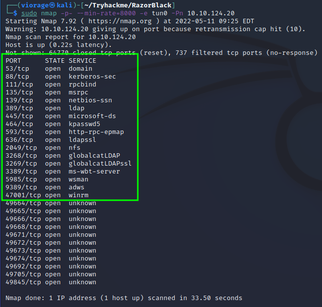
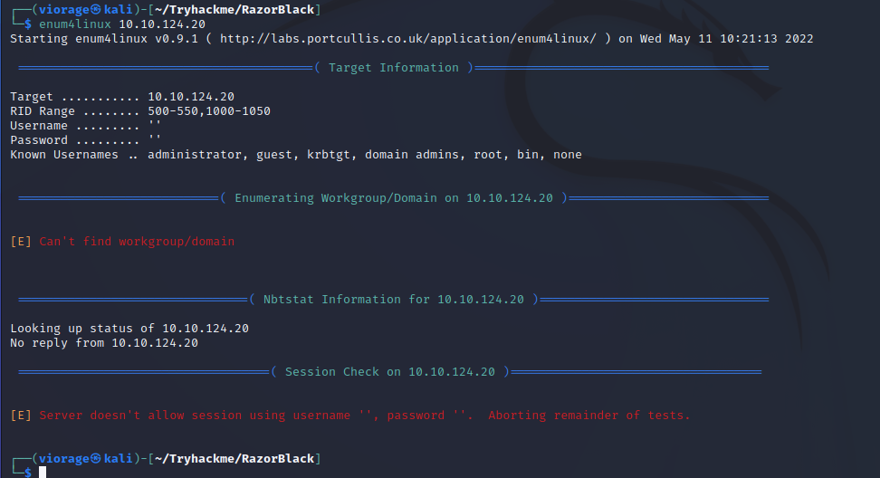
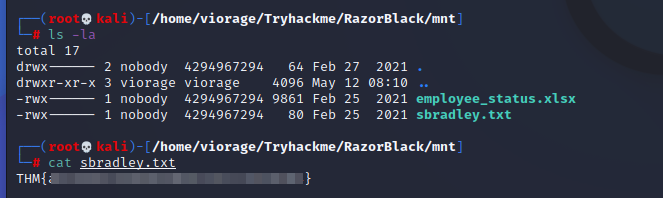
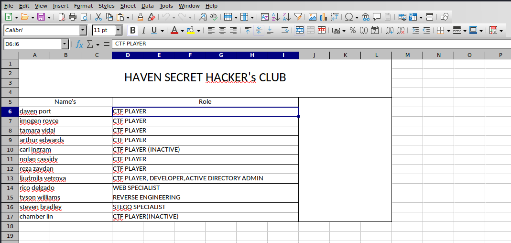
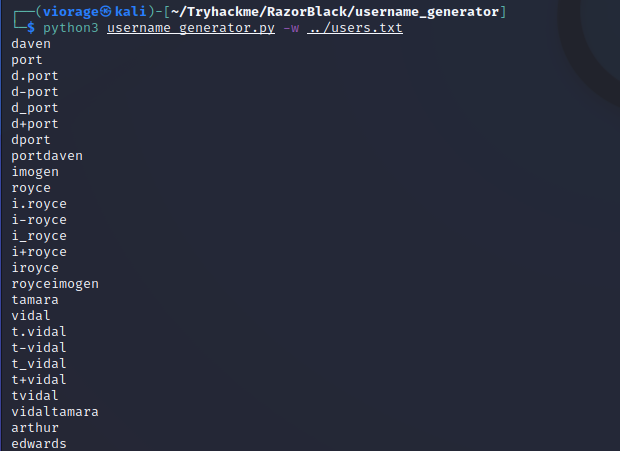

# RazorBlack
https://tryhackme.com/room/raz0rblack
These guys call themselves hackers. Can you show them who's the boss ??


___

## Initial Scan
The initial scan `sudo nmap -p- --min-rate=8000 -e tun0 -Pn 10.10.124.20` reveals quite a lot of open ports.



___

## Default Script + Version Scan
Now that we know what ports are open let's run a more verbose scan to see what we can find, I am leaving out the ephermeral ports for the time being.

Here I am spoofing my `useragent` and was going to spoof my IP with `-S`, hence the `-e` (uses a specific interface in order to spoof your IP but I forgot)

```console
sudo nmap -sVC -p 53,88,111,135,139,389,445,464,593,636,2049,3268,3389,5985,9389,47001 -e tun0 -Pn --script http-headers --script-args http.useragent="[Mozilla/5.0 (X11; Linux x86_64; rv:91.0) Gecko/20100101 Firefox/91.0]" -oN script-scan 10.10.124.20
```

There is a lot of output, let's `cat` the output file and pipe it to my clipboard to paste here `cat script-scan | xclip -selection clipboard`

```console
# Nmap 7.92 scan initiated Wed May 11 09:35:10 2022 as: nmap -sVC -p 53,88,111,135,139,389,445,464,593,636,2049,3268,3389,5985,9389,47001 -e tun0 -Pn --script http-headers --script-args "http.useragent=[Mozilla/5.0 (X11; Linux x86_64; rv:91.0) Gecko/20100101 Firefox/91.0]" -oN script-scan 10.10.124.20
Nmap scan report for 10.10.124.20
Host is up (0.22s latency).

PORT      STATE SERVICE       VERSION
53/tcp    open  domain        Simple DNS Plus
88/tcp    open  kerberos-sec  Microsoft Windows Kerberos (server time: 2022-05-11 13:35:31Z)
111/tcp   open  rpcbind       2-4 (RPC #100000)
| rpcinfo: 
|   program version    port/proto  service
|   100000  2,3,4        111/tcp   rpcbind
|   100000  2,3,4        111/tcp6  rpcbind
|   100000  2,3,4        111/udp   rpcbind
|   100000  2,3,4        111/udp6  rpcbind
|   100003  2,3         2049/udp   nfs
|   100003  2,3         2049/udp6  nfs
|   100003  2,3,4       2049/tcp   nfs
|   100003  2,3,4       2049/tcp6  nfs
|   100005  1,2,3       2049/tcp   mountd
|   100005  1,2,3       2049/tcp6  mountd
|   100005  1,2,3       2049/udp   mountd
|   100005  1,2,3       2049/udp6  mountd
|   100021  1,2,3,4     2049/tcp   nlockmgr
|   100021  1,2,3,4     2049/tcp6  nlockmgr
|   100021  1,2,3,4     2049/udp   nlockmgr
|   100021  1,2,3,4     2049/udp6  nlockmgr
|   100024  1           2049/tcp   status
|   100024  1           2049/tcp6  status
|   100024  1           2049/udp   status
|_  100024  1           2049/udp6  status
135/tcp   open  msrpc         Microsoft Windows RPC
139/tcp   open  netbios-ssn   Microsoft Windows netbios-ssn
389/tcp   open  ldap          Microsoft Windows Active Directory LDAP (Domain: raz0rblack.thm, Site: Default-First-Site-Name)
445/tcp   open  microsoft-ds?
464/tcp   open  kpasswd5?
593/tcp   open  ncacn_http    Microsoft Windows RPC over HTTP 1.0
636/tcp   open  tcpwrapped
2049/tcp  open  mountd        1-3 (RPC #100005)
3268/tcp  open  ldap          Microsoft Windows Active Directory LDAP (Domain: raz0rblack.thm, Site: Default-First-Site-Name)
3389/tcp  open  ms-wbt-server Microsoft Terminal Services
5985/tcp  open  http          Microsoft HTTPAPI httpd 2.0 (SSDP/UPnP)
| http-headers: 
|   Content-Type: text/html; charset=us-ascii
|   Server: Microsoft-HTTPAPI/2.0
|   Date: Wed, 11 May 2022 13:36:22 GMT
|   Connection: close
|   Content-Length: 315
|   
|_  (Request type: GET)
|_http-server-header: Microsoft-HTTPAPI/2.0
9389/tcp  open  mc-nmf        .NET Message Framing
47001/tcp open  http          Microsoft HTTPAPI httpd 2.0 (SSDP/UPnP)
| http-headers: 
|   Content-Type: text/html; charset=us-ascii
|   Server: Microsoft-HTTPAPI/2.0
|   Date: Wed, 11 May 2022 13:36:22 GMT
|   Connection: close
|   Content-Length: 315
|   
|_  (Request type: GET)
|_http-server-header: Microsoft-HTTPAPI/2.0
Service Info: Host: HAVEN-DC; OS: Windows; CPE: cpe:/o:microsoft:windows

Service detection performed. Please report any incorrect results at https://nmap.org/submit/ .
# Nmap done at Wed May 11 09:38:37 2022 -- 1 IP address (1 host up) scanned in 207.36 seconds
```

We have some decent information, let's take note of a few items
- Domain Name: raz0rblack.thm
- Potential Host Name: HAVEN-DC


Looks like we have a lot of work to do but we can answer the first question from our nmap scan.

> What is the Domain Name? **raz0rblack.thm**

___

## SMB Port 445
First, I'll just get some basic information using `crackmapexec`

```console
┌──(viorage㉿kali)-[~/Tryhackme/RazorBlack]
└─$ crackmapexec smb raz0rblack.thm                    
SMB         raz0rblack.thm  445    HAVEN-DC         [*] Windows 10.0 Build 17763 x64 (name:HAVEN-DC) (domain:raz0rblack.thm) (signing:True) (SMBv1:False)
```

I messed around with `smbclient` , `enum4linux`, and `smbmap` to no avail.

```console
┌──(viorage㉿kali)-[~/Tryhackme/RazorBlack]
└─$ smbmap -H 10.10.124.20  
[+] IP: 10.10.124.20:445        Name: raz0rblack.thm  

┌──(viorage㉿kali)-[~/Tryhackme/RazorBlack]
└─$ smbmap -H 10.10.124.20 -u anonymous -d raz0rblack.thm
[!] Authentication error on 10.10.124.20

┌──(viorage㉿kali)-[~/Tryhackme/RazorBlack]
└─$ smbclient -L //10.10.124.20 -N
Anonymous login successful

        Sharename       Type      Comment
        ---------       ----      -------
Reconnecting with SMB1 for workgroup listing.
do_connect: Connection to 10.10.124.20 failed (Error NT_STATUS_RESOURCE_NAME_NOT_FOUND)
Unable to connect with SMB1 -- no workgroup available
```


___

## NFS Port 2049

Leaving SMB for now and checking to see if any shares are mounted with the `showmount -e` command.

```console
┌──(viorage㉿kali)-[~/Tryhackme/RazorBlack]
└─$ showmount -e 10.10.66.226
Export list for 10.10.66.226:
/users (everyone)
```

Awesome, we have a `/users` share that `everyone` can mount. To mount the share first `mkdir mnt` then use the `mount` command. To do this you must use `sudo`.

Since the share was mounted as the root user, I switch to `root` and went into the `mnt`.

```console
┌──(viorage㉿kali)-[~/Tryhackme/RazorBlack]
└─$ sudo mount -t nfs 10.10.66.226:/users mnt  

┌──(viorage㉿kali)-[~/Tryhackme/RazorBlack]
└─$ sudo su                                                                                                                                                       1 ⨯
┌──(root💀kali)-[/home/viorage/Tryhackme/RazorBlack]
└─# cd mnt
                                                                                                                                                                      
┌──(root💀kali)-[/home/viorage/Tryhackme/RazorBlack/mnt]
└─# ls
employee_status.xlsx  sbradley.txt
```

Here I found two files

```console
┌──(root💀kali)-[/home/viorage/Tryhackme/RazorBlack/mnt]
└─# ls -la
total 17
drwx------ 2 nobody  4294967294   64 Feb 27  2021 .
drwxr-xr-x 3 viorage viorage    4096 May 12 08:10 ..
-rwx------ 1 nobody  4294967294 9861 Feb 25  2021 employee_status.xlsx
-rwx------ 1 nobody  4294967294   80 Feb 25  2021 sbradley.txt
```

Opening the `sbradley.txt` file gives us the next user flag:



> What is Steven's Flag? **THM{Redacted}**

___

## Continue NFS
I copied the `employee_status.xlsx` back to my home directory. As seen above we don't have the ability to write to the share at the moment.

```console
┌──(root💀kali)-[/home/viorage/Tryhackme/RazorBlack/mnt]
└─# cp employee_status.xlsx ../
```

#### Employee_Status.xlsx
We need to find a way to read this file on our Kali machine or we can copy it to a Windows machine and open with `Excel`. An xlsx file is a zip-compressed XML spreadsheet. You can unzip this file and read everything manually or you can install `Libre Office` and open the file there. I chose the second options

First, I installed Libre Office

```console
sudo apt install libreoffice
```

The owner of this file is `root` at the time so I changed the ownership back to my user.

```console
┌──(viorage㉿kali)-[~/Tryhackme/RazorBlack]
└─$ sudo chown viorage:viorage employee_status.xlsx
```

Next, simply open `Libre Calc` and then open the file.



___

## HAVEN SECRET HACKER'S CLUB
This file containes a column of `Names` and `Roles`. I'm not sure at this time whether the roles are important but the names definitely could be.

|Names|
|----------|
|daven port|
|imogen royce|
|tamara vidal|
|arthur edwards|
|carl ingram|
|nolan cassidy|
|reza zaydan|
|ljudmila vetrova|
|rico delgado|
|tyson williams|
|steven bradley|
|chamber lin|

Usernames are usually single words with no spaces. There are a few common ways accounts are made, one being `first-initial.lastname` so an example here would be 'd.port'. Another option is `first-name.last-initla` so `daven.port`. Then there are the same options without the `.` so `davenp` and `dport`. The file above was named `sbradley.txt` so that gives us a hint. 

Let's be thorough here and just create a username list with several different options using `username_generator` from github.

```console
┌──(viorage㉿kali)-[~/Tryhackme/RazorBlack]                                                                                      
└─$ git clone https://github.com/therodri2/username_generator.git                                                                 
Cloning into 'username_generator'...                                                                                              
remote: Enumerating objects: 9, done.                                                                                                 
remote: Counting objects: 100% (9/9), done.                                                                                
remote: Compressing objects: 100% (7/7), done.                                                                                  
remote: Total 9 (delta 0), reused 0 (delta 0), pack-reused 0                                                                    
Receiving objects: 100% (9/9), done. 
```



___