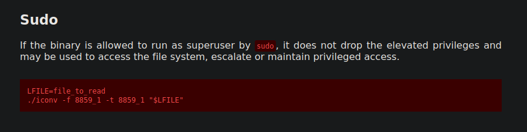

# Tech_Supp0rt: 1

Hack into the scammer's under-development website to foil their plans.

https://tryhackme.com/room/techsupp0rt1


___

## Nmap 
Enumerating the target with nmap, I usually run a quick scan on all the TCP ports.

```sh
┌──(viorage㉿kali)-[~/Tryhackme/Tech]                                                                                                                                                 
└─$ nmap -p-  --min-rate=8000 10.10.29.72                                                                                           
Starting Nmap 7.92 ( https://nmap.org ) at 2022-04-16 16:35 EDT                                                         
Nmap scan report for 10.10.29.72                                                                                   
Host is up (0.23s latency).                                                                                                      
Not shown: 65531 closed tcp ports (conn-refused)                                                                                                                                      
PORT    STATE SERVICE                                                              
22/tcp  open  ssh                                                                    
80/tcp  open  http   
139/tcp open  netbios-ssn            
445/tcp open  microsoft-ds                                                                 
                                                                                           
Nmap done: 1 IP address (1 host up) scanned in 17.29 seconds 
```

After the initial scan I run a default script and version scan on the open ports

```sh
┌──(viorage㉿kali)-[~/Tryhackme/Tech]                                                      
└─$ sudo nmap -sVC -p 22,80,139,445 -oN script 10.10.29.72                                 
[sudo] password for viorage:                                                               
Starting Nmap 7.92 ( https://nmap.org ) at 2022-04-16 16:36 EDT                            
Nmap scan report for 10.10.29.72                                                           
Host is up (0.23s latency).                                                                
                                                                                           
PORT    STATE SERVICE     VERSION                                                          
22/tcp  open  ssh         OpenSSH 7.2p2 Ubuntu 4ubuntu2.10 (Ubuntu Linux; protocol 2.0)    
| ssh-hostkey:                                                                             
|   2048 10:8a:f5:72:d7:f9:7e:14:a5:c5:4f:9e:97:8b:3d:58 (RSA)                                                            
|   256 7f:10:f5:57:41:3c:71:db:b5:5b:db:75:c9:76:30:5c (ECDSA)                            
|_  256 6b:4c:23:50:6f:36:00:7c:a6:7c:11:73:c1:a8:60:0c (ED25519)                          
80/tcp  open  http        Apache httpd 2.4.18 ((Ubuntu))                                  
|_http-title: Apache2 Ubuntu Default Page: It works                                                       
|_http-server-header: Apache/2.4.18 (Ubuntu)                                               
139/tcp open  netbios-ssn Samba smbd 3.X - 4.X (workgroup: WORKGROUP)                                                                                                                 
445/tcp open  netbios-ssn Samba smbd 4.3.11-Ubuntu (workgroup: WORKGROUP)                  
Service Info: Host: TECHSUPPORT; OS: Linux; CPE: cpe:/o:linux:linux_kernel                 
                                                                                           
Host script results:                                                                       
| smb-security-mode:                                                                       
|   account_used: guest                                                                    
|   authentication_level: user                                                             
|   challenge_response: supported                                                          
|_  message_signing: disabled (dangerous, but default)                                                                           
| smb2-security-mode:                                                                                                         
|   3.1.1:                                                                                                                 
|_    Message signing enabled but not required                                                                     
| smb2-time:                                                                      
|   date: 2022-04-16T20:37:04                                                                                              
|_  start_date: N/A                                                              
| smb-os-discovery:                                                                                                       
|   OS: Windows 6.1 (Samba 4.3.11-Ubuntu)                                    
|   Computer name: techsupport                                                                                    
|   NetBIOS computer name: TECHSUPPORT\x00                                                                              
|   Domain name: \x00                                                                                                            
|   FQDN: techsupport                                                                           
|_  System time: 2022-04-17T02:07:02+05:30                                                                                       
|_clock-skew: mean: -1h49m59s, deviation: 3h10m31s, median: 0s                                                                           
```

From here it's a toss up of where to enumerate next, with the scan on port 80 giving me an `Ubuntu Default Page:  It works` notification I decided to kickoff a gobuster scan. While that is running I will enumerate SMB

___

## SMB Port 445/139

Let's start with smbmap to see if there are any open shares.

```sh
┌──(viorage㉿kali)-[~/Tryhackme/Demo/.ssh]
└─$ smbmap -H 10.10.108.217                               
[+] Guest session       IP: 10.10.108.217:445   Name: 10.10.108.217                                     
        Disk                                                    Permissions     Comment
        ----                                                    -----------     -------
        print$                                                  NO ACCESS       Printer Drivers
        websvr                                                  READ ONLY
        IPC$                                                    NO ACCESS       IPC Service (TechSupport server (Samba, Ubuntu))
```

It looks like we can read the websvr share. Let us connect and see what we have.

```sh
┌──(viorage㉿kali)-[~]
└─$ smbclient \\\\10.10.108.217\\websvr                   
Enter WORKGROUP\viorage's password: 
Try "help" to get a list of possible commands.
smb: \> dir
  .                                   D        0  Sat May 29 03:17:38 2021
  ..                                  D        0  Sat May 29 03:03:47 2021
  enter.txt                           N      273  Sat May 29 03:17:38 2021

                8460484 blocks of size 1024. 5694420 blocks available
smb: \> 
```

```enter.txt``` might be interesting let's take a look

```console
└─$ cat enter.txt                      
GOALS
=====
1)Make fake popup and host it online on Digital Ocean server
2)Fix subrion site, /subrion doesn't work, edit from panel
3)Edit wordpress website

IMP
===
Subrion creds
|->admin:redacted [cooked with magical formula]
Wordpress creds
|->
```


We have some goals.

1.) Make fake popup and host it online on Digital Ocean server.
It looks like this was completed, if we go to ```http://10.10.108.217/test/``` we get a fake popup essentially saying our system has been compromised.


2.) Fix subrion site, /subrion doesn't work, edit from panel

I tried browsing to /subrion but as the note said, it didn't work.

3.) Edit wordpress website

It says to edit the wordpress site and below that we have some potential creds for ```admin``` but they have been ```cooked with magical forumla```. This makes me think that the ```magic``` function of https://cyberchef.immersivelabs.online might be useful. So let's take a look and as suspected we are given ```Redacted``` for the admin account password.


___ 

## Wordpress

I assumed the credentials were for the wordpress login portal, but they didn't work. I am however, given a clue that they username is unknown.


___
## Subrion Site

After some messing around I went back an re-read the note. I wanted to dig a bit deeper into the ```/subrion``` message. It clearly says edit from panel so it seems that ```panel``` is an obvious choice to check out. 


The credentials work AND we are given a CMS version of `v4.2.1`. 

___
## Searchsploit

I utilized searchsploit to see if I could find a quick win and there is an 'Arbitrary File Upload' vulnerability.


I download the exploit script and ran it with the -h switch which gave me the following options.

```sh
└─$ python3 49876.py -h                                                     
Usage: 49876.py [options]

Options:
  -h, --help            show this help message and exit
  -u URL, --url=URL     Base target uri http://target/panel
  -l USER, --user=USER  User credential to login
  -p PASSW, --passw=PASSW
                        Password credential to login
```

Running the script with the credentials gives a reverse shell.


___

## Full TTY
I tried to stabalize the shell from the exploit but it killed my session. I re-ran the exploit and spawned a fresh session with a Python reverse shell and the unbreakable pwncat listener. However, that also did not work so let's just try a normal listener, which did work. Don't forget to fix your rows and columns


---
## Target Enumeration

I began going through the configuration files for the websites and found credentials for`support` with a password of `Redacted`


## Scamsite User

I checked for other users with `cat /etc/passwd` and found a `scamsite` user. The newly found password worked for that user and I am now the user `scamsite`

```sh
www-data@TechSupport:/var/www/html/wordpress$ cat /etc/passwd
root:x:0:0:root:/root:/bin/bash
daemon:x:1:1:daemon:/usr/sbin:/usr/sbin/nologin
bin:x:2:2:bin:/bin:/usr/sbin/nologin
sys:x:3:3:sys:/dev:/usr/sbin/nologin
sync:x:4:65534:sync:/bin:/bin/sync
games:x:5:60:games:/usr/games:/usr/sbin/nologin
man:x:6:12:man:/var/cache/man:/usr/sbin/nologin
lp:x:7:7:lp:/var/spool/lpd:/usr/sbin/nologin
mail:x:8:8:mail:/var/mail:/usr/sbin/nologin
news:x:9:9:news:/var/spool/news:/usr/sbin/nologin
uucp:x:10:10:uucp:/var/spool/uucp:/usr/sbin/nologin
proxy:x:13:13:proxy:/bin:/usr/sbin/nologin
www-data:x:33:33:www-data:/var/www:/usr/sbin/nologin
backup:x:34:34:backup:/var/backups:/usr/sbin/nologin
list:x:38:38:Mailing List Manager:/var/list:/usr/sbin/nologin
irc:x:39:39:ircd:/var/run/ircd:/usr/sbin/nologin
gnats:x:41:41:Gnats Bug-Reporting System (admin):/var/lib/gnats:/usr/sbin/nologin
nobody:x:65534:65534:nobody:/nonexistent:/usr/sbin/nologin
systemd-timesync:x:100:102:systemd Time Synchronization,,,:/run/systemd:/bin/false
systemd-network:x:101:103:systemd Network Management,,,:/run/systemd/netif:/bin/false
systemd-resolve:x:102:104:systemd Resolver,,,:/run/systemd/resolve:/bin/false
systemd-bus-proxy:x:103:105:systemd Bus Proxy,,,:/run/systemd:/bin/false
syslog:x:104:108::/home/syslog:/bin/false
_apt:x:105:65534::/nonexistent:/bin/false
lxd:x:106:65534::/var/lib/lxd/:/bin/false
messagebus:x:107:111::/var/run/dbus:/bin/false
uuidd:x:108:112::/run/uuidd:/bin/false
dnsmasq:x:109:65534:dnsmasq,,,:/var/lib/misc:/bin/false
sshd:x:110:65534::/var/run/sshd:/usr/sbin/nologin
scamsite:x:1000:1000:scammer,,,:/home/scamsite:/bin/bash
mysql:x:111:119:MySQL Server,,,:/nonexistent:/bin/false
www-data@TechSupport:/var/www/html/wordpress$ su - scamsite
Password: 
scamsite@TechSupport:~$ id
uid=1000(scamsite) gid=1000(scamsite) groups=1000(scamsite),113(sambashare)
```

I ran ```sudo -l``` and we can run ```/usr/bin/iconv``` as root.

```sh
scamsite@TechSupport:~$ sudo -l
Matching Defaults entries for scamsite on TechSupport:
    env_reset, mail_badpass, secure_path=/usr/local/sbin\:/usr/local/bin\:/usr/sbin\:/usr/bin\:/sbin\:/bin\:/snap/bin

User scamsite may run the following commands on TechSupport:
    (ALL) NOPASSWD: /usr/bin/iconv
```

___

## GTFO Bins

Checking GTFO bins for iconv and it allows me to read files https://gtfobins.github.io/gtfobins/iconv/



## Root.txt

Now we can read root.txt


